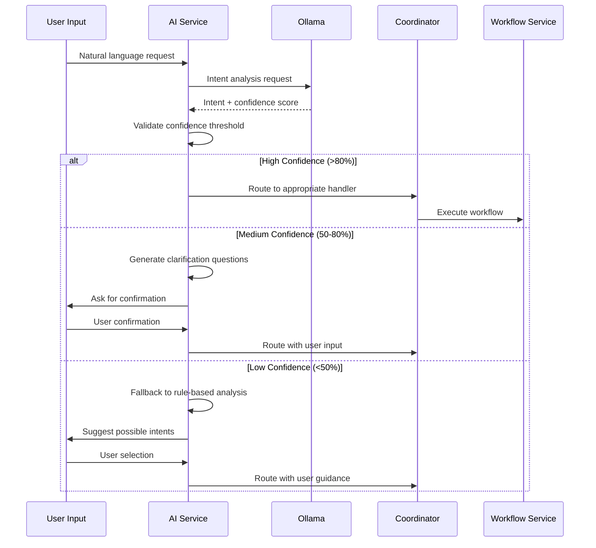

# AI Intent Analysis Strategy & Edge Case Handling

**Project:** Hệ thống hỗ trợ vận hành tập trung với AI  
**Date:** 2024-12-19  
**Version:** 1.0  
**Status:** Draft

---

## Executive Summary

This document defines the comprehensive strategy for AI Intent Analysis using Ollama, including fallback mechanisms, edge case handling, and confidence thresholds to ensure system reliability and user satisfaction.

**Key Principles:**
- **Graceful Degradation:** System continues to function even when AI analysis fails
- **User Feedback Loop:** Learn from user corrections to improve accuracy
- **Confidence-Based Routing:** Route requests based on AI confidence levels
- **Fallback Escalation:** Escalate to human agents when AI cannot handle

---

## AI Intent Analysis Flow

### 1. Primary Analysis Flow



### 2. Confidence Thresholds

| Confidence Level | Range | Action | Fallback Strategy |
|------------------|-------|---------|-------------------|
| **High** | 80-100% | Direct routing | None needed |
| **Medium** | 50-79% | Confirmation required | User clarification |
| **Low** | 30-49% | Rule-based fallback | Intent suggestions |
| **Very Low** | 0-29% | Human escalation | Helpdesk ticket |

---

## Edge Case Scenarios & Handling

### 1. Ambiguous User Requests

#### Scenario: Multiple Possible Intents
**Example:** "Tôi cần hỗ trợ về dịch vụ"
**Analysis:** Could be customer support, service inquiry, or technical issue

**Handling Strategy:**
```javascript
// AI Service - Intent Disambiguation
async function handleAmbiguousIntent(message, possibleIntents) {
  if (possibleIntents.length === 1) {
    return { intent: possibleIntents[0], confidence: 0.9 };
  }
  
  // Generate clarification questions
  const questions = generateClarificationQuestions(possibleIntents);
  
  return {
    intent: 'ambiguous',
    confidence: 0.3,
    clarification: {
      type: 'multiple_choice',
      question: 'Bạn cần hỗ trợ về vấn đề gì cụ thể?',
      options: possibleIntents.map(intent => ({
        value: intent.id,
        label: intent.description,
        examples: intent.examples
      }))
    }
  };
}
```

#### Scenario: Unclear Context
**Example:** "Có vấn đề với hệ thống"
**Analysis:** Missing context about which system, what type of issue

**Handling Strategy:**
```javascript
// AI Service - Context Extraction
async function extractMissingContext(message, detectedIntent) {
  const requiredContext = getRequiredContext(detectedIntent);
  const missingFields = [];
  
  for (const field of requiredContext) {
    if (!message.includes(field.keywords)) {
      missingFields.push(field);
    }
  }
  
  if (missingFields.length > 0) {
    return {
      intent: detectedIntent,
      confidence: 0.6,
      clarification: {
        type: 'context_gathering',
        message: `Để xử lý yêu cầu này, tôi cần thêm thông tin:`,
        questions: missingFields.map(field => field.question)
      }
    };
  }
  
  return { intent: detectedIntent, confidence: 0.9 };
}
```

### 2. Language Processing Issues

#### Scenario: Mixed Languages
**Example:** "I need help với dịch vụ topup"
**Analysis:** Mixed Vietnamese and English

**Handling Strategy:**
```javascript
// AI Service - Language Normalization
async function normalizeMixedLanguage(message) {
  // Detect primary language
  const primaryLang = detectPrimaryLanguage(message);
  
  // Translate mixed parts to primary language
  const normalizedMessage = await translateMixedParts(message, primaryLang);
  
  // Re-analyze with normalized message
  return await analyzeIntent(normalizedMessage);
}
```

#### Scenario: Informal/Abbreviated Language
**Example:** "có vấn đề vs hệ thống topup"
**Analysis:** Informal abbreviations ("vs" = "với")

**Handling Strategy:**
```javascript
// AI Service - Informal Language Normalization
const informalMappings = {
  'vs': 'với',
  'ko': 'không',
  'dc': 'được',
  'vk': 'vậy',
  'j': 'gì'
};

async function normalizeInformalLanguage(message) {
  let normalizedMessage = message;
  
  for (const [informal, formal] of Object.entries(informalMappings)) {
    normalizedMessage = normalizedMessage.replace(
      new RegExp(`\\b${informal}\\b`, 'gi'), 
      formal
    );
  }
  
  return normalizedMessage;
}
```

### 3. Technical Failures

#### Scenario: Ollama Service Unavailable
**Example:** Ollama container down or network issues

**Handling Strategy:**
```javascript
// AI Service - Service Fallback
async function analyzeIntentWithFallback(message) {
  try {
    // Primary: Ollama analysis
    const ollamaResult = await ollamaClient.analyze(message);
    return ollamaResult;
  } catch (ollamaError) {
    console.warn('Ollama unavailable, falling back to rule-based analysis');
    
    // Fallback: Rule-based analysis
    const ruleBasedResult = await ruleBasedIntentAnalysis(message);
    
    // Log for monitoring
    await logFallbackUsage('ollama_unavailable', message, ruleBasedResult);
    
    return {
      ...ruleBasedResult,
      fallbackUsed: true,
      fallbackReason: 'ollama_unavailable'
    };
  }
}
```

#### Scenario: Model Loading Issues
**Example:** Ollama model not loaded or corrupted

**Handling Strategy:**
```javascript
// AI Service - Model Health Check
async function checkModelHealth() {
  try {
    const healthCheck = await ollamaClient.health();
    
    if (!healthCheck.models.includes('llama2:7b')) {
      // Attempt to load model
      await ollamaClient.pull('llama2:7b');
    }
    
    return true;
  } catch (error) {
    console.error('Model health check failed:', error);
    return false;
  }
}
```

---

## Fallback Mechanisms

### 1. Rule-Based Intent Analysis

When AI analysis fails or confidence is too low, the system falls back to rule-based pattern matching:

```javascript
// Fallback Service - Rule-Based Analysis
class RuleBasedIntentAnalyzer {
  constructor() {
    this.intentPatterns = {
      'create_notification': [
        /tạo thông báo/i,
        /gửi thông báo/i,
        /thông báo cho/i
      ],
      'check_logs': [
        /kiểm tra log/i,
        /xem log/i,
        /check log/i
      ],
      'create_ticket': [
        /tạo ticket/i,
        /tạo yêu cầu hỗ trợ/i,
        /báo cáo vấn đề/i
      ],
      'system_status': [
        /trạng thái hệ thống/i,
        /hệ thống có ổn không/i,
        /kiểm tra hệ thống/i
      ]
    };
  }
  
  async analyze(message) {
    const scores = {};
    
    for (const [intent, patterns] of Object.entries(this.intentPatterns)) {
      let score = 0;
      
      for (const pattern of patterns) {
        if (pattern.test(message)) {
          score += 1;
        }
      }
      
      if (score > 0) {
        scores[intent] = score / patterns.length;
      }
    }
    
    // Return best match
    const bestIntent = Object.entries(scores)
      .sort(([,a], [,b]) => b - a)[0];
    
    if (bestIntent && bestIntent[1] > 0.3) {
      return {
        intent: bestIntent[0],
        confidence: bestIntent[1],
        method: 'rule_based',
        fallbackUsed: true
      };
    }
    
    return {
      intent: 'unknown',
      confidence: 0.0,
      method: 'rule_based',
      fallbackUsed: true
    };
  }
}
```

### 2. Human Escalation

When all automated methods fail, escalate to human agents:

```javascript
// Escalation Service
class HumanEscalationService {
  async escalateToHuman(message, analysisResult) {
    const ticket = await this.createHelpdeskTicket({
      title: 'AI Intent Analysis Failed',
      description: `Message: ${message}\nAnalysis Result: ${JSON.stringify(analysisResult)}`,
      priority: 'medium',
      category: 'ai_escalation',
      aiAssisted: false
    });
    
    // Notify human agents
    await this.notifyHumanAgents(ticket);
    
    // Send user confirmation
    return {
      intent: 'human_escalation',
      confidence: 1.0,
      message: 'Tôi không thể hiểu rõ yêu cầu của bạn. Yêu cầu đã được chuyển cho nhân viên hỗ trợ. Họ sẽ liên hệ với bạn trong thời gian sớm nhất.',
      ticketId: ticket.id
    };
  }
}
```

---

## Confidence Score Calculation

### 1. Base Confidence Factors

```javascript
// AI Service - Confidence Calculation
class ConfidenceCalculator {
  calculateConfidence(ollamaResponse, context) {
    let baseConfidence = ollamaResponse.confidence || 0.5;
    
    // Context relevance bonus
    if (context.hasRelevantKeywords) {
      baseConfidence += 0.1;
    }
    
    // User history bonus
    if (context.userHasSimilarRequests) {
      baseConfidence += 0.1;
    }
    
    // Time-based bonus (business hours)
    if (context.isBusinessHours) {
      baseConfidence += 0.05;
    }
    
    // Cap at 1.0
    return Math.min(baseConfidence, 1.0);
  }
}
```

### 2. Confidence Thresholds by Intent Type

| Intent Type | High Confidence | Medium Confidence | Low Confidence |
|-------------|-----------------|-------------------|----------------|
| **System Commands** | >90% | 70-90% | <70% |
| **Information Requests** | >80% | 60-80% | <60% |
| **Support Requests** | >75% | 55-75% | <55% |
| **Complex Operations** | >85% | 65-85% | <65% |

---

## Error Recovery & Learning

### 1. User Feedback Integration

```javascript
// Learning Service - User Feedback
class IntentLearningService {
  async processUserFeedback(messageId, userCorrection) {
    // Store correction for future learning
    await this.storeCorrection(messageId, userCorrection);
    
    // Update confidence thresholds if needed
    await this.updateConfidenceThresholds(userCorrection);
    
    // Retrain model if sufficient corrections exist
    if (await this.shouldRetrainModel()) {
      await this.retrainModel();
    }
  }
  
  async shouldRetrainModel() {
    const recentCorrections = await this.getRecentCorrections(7); // Last 7 days
    return recentCorrections.length >= 50; // Retrain after 50 corrections
  }
}
```

### 2. Performance Monitoring

```javascript
// Monitoring Service
class IntentAnalysisMonitor {
  async trackPerformance(analysisResult) {
    const metrics = {
      timestamp: new Date(),
      confidence: analysisResult.confidence,
      intent: analysisResult.intent,
      method: analysisResult.method,
      fallbackUsed: analysisResult.fallbackUsed || false,
      processingTime: analysisResult.processingTime
    };
    
    await this.storeMetrics(metrics);
    
    // Alert if performance degrades
    if (analysisResult.confidence < 0.3 && !analysisResult.fallbackUsed) {
      await this.alertLowConfidence(metrics);
    }
  }
}
```

---

## Implementation Guidelines

### 1. Service Integration

```javascript
// AI Service - Main Integration
class AIIntentService {
  constructor() {
    this.ollamaClient = new OllamaClient();
    this.ruleBasedAnalyzer = new RuleBasedIntentAnalyzer();
    this.confidenceCalculator = new ConfidenceCalculator();
    this.escalationService = new HumanEscalationService();
    this.learningService = new IntentLearningService();
    this.monitor = new IntentAnalysisMonitor();
  }
  
  async analyzeIntent(message, context = {}) {
    const startTime = Date.now();
    
    try {
      // Primary AI analysis
      let result = await this.ollamaClient.analyze(message);
      
      // Calculate confidence
      result.confidence = this.confidenceCalculator.calculateConfidence(result, context);
      
      // Handle based on confidence
      if (result.confidence >= 0.8) {
        result = await this.handleHighConfidence(result);
      } else if (result.confidence >= 0.5) {
        result = await this.handleMediumConfidence(result, message);
      } else if (result.confidence >= 0.3) {
        result = await this.handleLowConfidence(result, message);
      } else {
        result = await this.handleVeryLowConfidence(result, message);
      }
      
      // Add processing metadata
      result.processingTime = Date.now() - startTime;
      result.timestamp = new Date();
      
      // Track performance
      await this.monitor.trackPerformance(result);
      
      return result;
      
    } catch (error) {
      console.error('Intent analysis failed:', error);
      
      // Fallback to rule-based analysis
      const fallbackResult = await this.ruleBasedAnalyzer.analyze(message);
      fallbackResult.fallbackUsed = true;
      fallbackResult.error = error.message;
      
      return fallbackResult;
    }
  }
}
```

### 2. Configuration

```javascript
// AI Service Configuration
const AI_SERVICE_CONFIG = {
  confidence: {
    high: 0.8,
    medium: 0.5,
    low: 0.3,
    veryLow: 0.0
  },
  fallback: {
    enabled: true,
    ruleBased: true,
    humanEscalation: true
  },
  ollama: {
    timeout: 30000, // 30 seconds
    retries: 3,
    model: 'llama2:7b'
  },
  learning: {
    enabled: true,
    retrainThreshold: 50,
    retrainInterval: 7 // days
  }
};
```

---

## Testing Strategy

### 1. Unit Tests

```javascript
// Test cases for edge cases
describe('AI Intent Analysis Edge Cases', () => {
  test('handles ambiguous requests with clarification', async () => {
    const result = await aiService.analyzeIntent('Tôi cần hỗ trợ');
    expect(result.intent).toBe('ambiguous');
    expect(result.clarification).toBeDefined();
  });
  
  test('falls back to rule-based analysis when AI fails', async () => {
    // Mock Ollama failure
    ollamaClient.analyze.mockRejectedValue(new Error('Service unavailable'));
    
    const result = await aiService.analyzeIntent('Tạo thông báo cho khách hàng');
    expect(result.fallbackUsed).toBe(true);
    expect(result.intent).toBe('create_notification');
  });
  
  test('escalates to human when confidence is very low', async () => {
    const result = await aiService.analyzeIntent('Random gibberish text');
    expect(result.intent).toBe('human_escalation');
    expect(result.ticketId).toBeDefined();
  });
});
```

### 2. Integration Tests

```javascript
// End-to-end testing
describe('AI Intent Analysis Integration', () => {
  test('complete flow with high confidence', async () => {
    const result = await aiService.analyzeIntent('Tạo thông báo tạm dừng dịch vụ Vinaphone');
    expect(result.confidence).toBeGreaterThan(0.8);
    expect(result.intent).toBe('create_notification');
    expect(result.entities).toHaveProperty('service', 'Vinaphone');
  });
  
  test('complete flow with fallback', async () => {
    // Test with mixed language
    const result = await aiService.analyzeIntent('I need help với dịch vụ topup');
    expect(result.intent).toBeDefined();
    expect(result.confidence).toBeGreaterThan(0.3);
  });
});
```

---

## Monitoring & Alerting

### 1. Key Metrics

- **Intent Recognition Accuracy:** Percentage of correct intent classifications
- **Fallback Usage Rate:** Frequency of fallback mechanisms
- **Average Confidence Score:** Mean confidence across all requests
- **Processing Time:** Time taken for intent analysis
- **Error Rate:** Percentage of failed analyses

### 2. Alerting Rules

- **High Fallback Rate:** Alert if >20% requests use fallback in 1 hour
- **Low Confidence Trend:** Alert if average confidence <0.5 for 30 minutes
- **Service Errors:** Alert if >5% requests fail in 5 minutes
- **Performance Degradation:** Alert if average processing time >10 seconds

---

## Conclusion

This AI Intent Analysis Strategy provides comprehensive coverage for edge cases and fallback scenarios, ensuring system reliability and user satisfaction. The multi-layered approach with confidence-based routing, rule-based fallbacks, and human escalation creates a robust system that can handle various failure modes gracefully.

**Key Benefits:**
- ✅ **Reliability:** System continues to function even when AI fails
- ✅ **User Experience:** Clear communication about system capabilities
- ✅ **Learning:** Continuous improvement through user feedback
- ✅ **Monitoring:** Comprehensive tracking of system performance
- ✅ **Scalability:** Can handle increased load with fallback mechanisms

**Next Steps:**
1. Implement the fallback mechanisms in the AI Service
2. Add monitoring and alerting to the system
3. Create comprehensive test coverage for edge cases
4. Deploy with gradual rollout to monitor performance

---

*AI Intent Analysis Strategy created using BMAD-METHOD™ framework*
