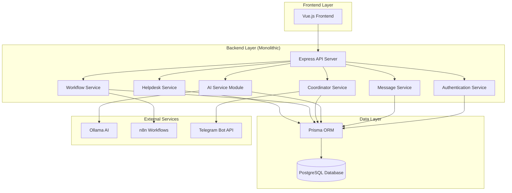
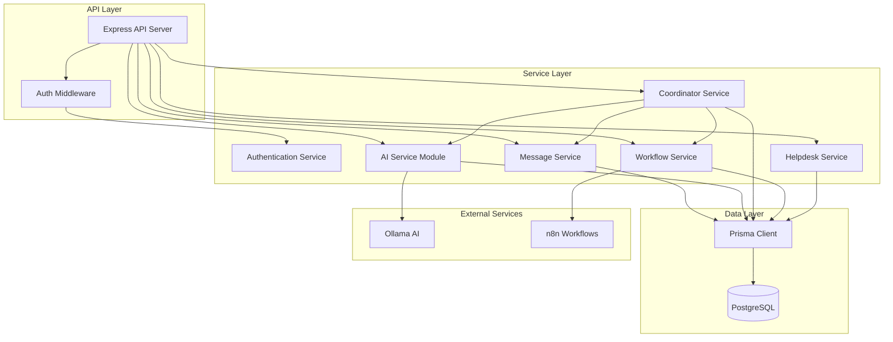
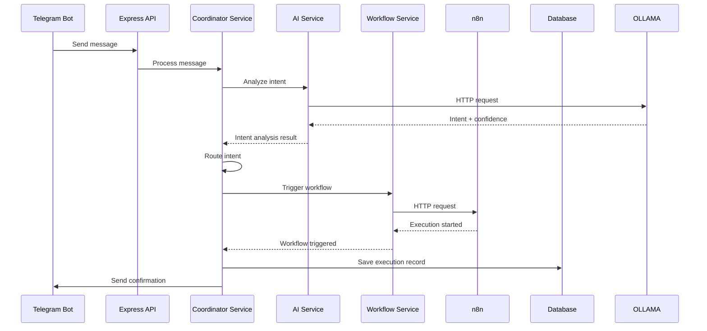
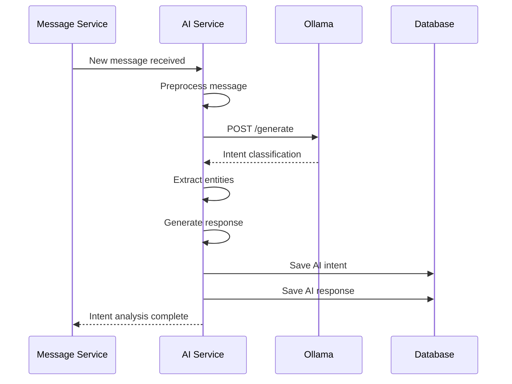

# Backend Architecture: Hệ thống hỗ trợ vận hành tập trung với AI

**Project Name:** Hệ thống hỗ trợ vận hành tập trung cho công ty bán mã thẻ, topup/airtime bán buôn  
**Date:** 2024-12-19  
**Version:** 1.0  
**Status:** Draft

---

## Introduction

### Scope and Assessment

This architecture document is for **SIMPLE enhancements** to the existing Unified Inbox System that can be implemented within the current monolithic structure without adding unnecessary complexity.

**Key Principle:** Keep it simple, extend existing patterns, avoid over-engineering.

### Intro Content

This document outlines the **simplified architectural approach** for enhancing the existing **Unified Inbox System** with **AI-powered Operations Support Center**. The goal is to add new AI capabilities while maintaining the existing simple, monolithic architecture.

**Relationship to Existing Architecture:**
This document extends the existing monolithic backend by adding new modules and services, following the same patterns already established in the codebase. No architectural changes, just functional extensions.

### Starter Template or Existing Project

Dựa trên phân tích, dự án này **KHÔNG sử dụng starter template** mà là **existing project** với:

- **Existing Codebase:** Unified Inbox System (Node.js + Express + Prisma + PostgreSQL)
- **Current Structure:** Monolithic backend với Vue.js frontend
- **Architecture Pattern:** Simple monolithic với modular services
- **Deployment:** Docker Compose với PostgreSQL

**Decision:** Extend existing monolithic structure với AI modules, không tạo mới từ đầu.

---

## High Level Architecture

### Technical Summary

Hệ thống sử dụng **monolithic architecture** với **modular service pattern** để mở rộng existing Unified Inbox System. Backend được xây dựng trên Node.js + Express với Prisma ORM và PostgreSQL database. Hệ thống tích hợp Ollama AI cho intent analysis và n8n cho workflow automation, tất cả trong cùng một Express application để đảm bảo simplicity và maintainability.

### High Level Overview

1. **Architectural Style:** Monolithic với modular services (không phải microservices)
2. **Repository Structure:** Monorepo (existing structure)
3. **Service Architecture:** Monolithic backend với service modules
4. **Primary Flow:** Telegram Bot → Coordinator Service → AI Analysis → Workflow Execution → Response
5. **Key Decisions:** 
   - Giữ nguyên existing architecture
   - Thêm AI modules vào existing Express app
   - Sử dụng existing authentication và database patterns

### High Level Project Diagram



### Architectural and Design Patterns

- **Monolithic Architecture:** Giữ nguyên existing structure - _Rationale:_ Đơn giản, dễ maintain, phù hợp với team size 1-2 dev
- **Modular Service Pattern:** Tách logic thành service modules - _Rationale:_ Code organization tốt, dễ test, không phức tạp hóa architecture
- **Repository Pattern:** Sử dụng Prisma với existing patterns - _Rationale:_ Consistent với existing codebase, dễ maintain
- **RESTful API:** Extend existing API patterns - _Rationale:_ Follow existing conventions, dễ integrate với frontend

---

## Tech Stack

### Cloud Infrastructure
- **Provider:** Local Development (Docker)
- **Key Services:** Docker Compose, PostgreSQL, n8n, Ollama
- **Deployment Regions:** Local development environment

### Technology Stack Table

| Category | Technology | Version | Purpose | Rationale |
|----------|------------|---------|---------|-----------|
| **Language** | JavaScript | ES2022 | Primary development language | Existing codebase, team expertise |
| **Runtime** | Node.js | ^20.19.0 | JavaScript runtime | Existing setup, LTS version |
| **Framework** | Express.js | ^5.1.0 | Web framework | Existing codebase, simple and flexible |
| **Database ORM** | Prisma | ^6.14.0 | Database access | Existing setup, type-safe, excellent tooling |
| **Database** | PostgreSQL | 14 | Primary database | Existing setup, ACID compliance, JSON support |
| **Real-time** | Socket.io | ^4.8.1 | Real-time communication | Existing setup, excellent for chat applications |
| **AI Integration** | Ollama | Latest | Local AI model | Privacy-focused, offline-capable, simple HTTP API |
| **Workflow Engine** | n8n | Latest | Workflow automation | Visual workflow builder, excellent for business logic |
| **Authentication** | JWT + bcryptjs | ^9.0.2 + ^3.0.2 | User authentication | Existing setup, secure and standard |
| **Validation** | Express-validator | Latest | Input validation | Lightweight, integrates well with Express |
| **Logging** | Winston | Latest | Application logging | Structured logging, production-ready |
| **Testing** | Jest | Latest | Unit testing | Standard for Node.js, excellent tooling |
| **Development** | Nodemon | ^3.1.10 | Development server | Existing setup, auto-restart on changes |

---

## Data Models

### Core Business Entities

#### User Management Models
**User Model**
**Purpose:** Quản lý người dùng hệ thống (admin, agent, customer, supplier)

**Key Attributes:**
- `id`: UUID - Primary key
- `email`: String - Email đăng nhập (unique)
- `name`: String - Tên đầy đủ
- `password`: String - Mật khẩu đã hash
- `role`: Enum - ADMIN, AGENT, CUSTOMER, SUPPLIER
- `telegramId`: String? - ID Telegram (optional)
- `status`: Enum - ACTIVE, INACTIVE, SUSPENDED
- `createdAt`: DateTime - Thời gian tạo
- `updatedAt`: DateTime - Thời gian cập nhật

**Relationships:**
- One-to-many với Message (existing)
- One-to-many với AI Intent (new)
- One-to-many với Helpdesk Ticket (new)

#### AI Integration Models
**AI Intent Model**
**Purpose:** Lưu trữ kết quả phân tích intent từ Ollama

**Key Attributes:**
- `id`: UUID - Primary key
- `messageId`: String - Reference to existing Message
- `intent`: String - Classified intent (e.g., "create_notification", "check_logs")
- `confidence`: Float - AI confidence score (0.0-1.0)
- `entities`: JSON - Extracted entities from message
- `context`: JSON - Additional context for intent analysis
- `processedAt`: DateTime - When AI processing occurred
- `modelVersion`: String - Ollama model version used

**Relationships:**
- Many-to-one với Message (existing)
- One-to-many với AI Response (new)

**AI Response Model**
**Purpose:** Lưu trữ response được tạo bởi AI và actions cần thực hiện

**Key Attributes:**
- `id`: UUID - Primary key
- `intentId`: String - Reference to AI Intent
- `responseType`: Enum - BOT_REPLY, ACTION_REQUIRED, WORKFLOW_TRIGGER
- `content`: Text - AI-generated response content
- `actions`: JSON - Required actions (webhook calls, notifications)
- `status`: Enum - PENDING, PROCESSING, COMPLETED, FAILED
- `createdAt`: DateTime - Response creation timestamp
- `processedAt`: DateTime - When response was processed

**Relationships:**
- Many-to-one với AI Intent (new)
- One-to-many với Workflow Execution (new)

#### Workflow Management Models
**Workflow Execution Model**
**Purpose:** Track n8n workflow executions và results

**Key Attributes:**
- `id`: UUID - Primary key
- `responseId`: String - Reference to AI Response
- `workflowId`: String - n8n workflow identifier
- `executionId`: String - n8n execution identifier
- `status`: Enum - RUNNING, COMPLETED, FAILED, CANCELLED
- `input`: JSON - Input data sent to workflow
- `result`: JSON - Workflow execution result
- `error`: Text? - Error message if failed
- `startedAt`: DateTime - Execution start time
- `completedAt`: DateTime? - Execution completion time
- `duration`: Integer? - Execution duration in milliseconds

**Relationships:**
- Many-to-one với AI Response (new)
- One-to-many với Notification (new)

**Notification Model**
**Purpose:** Track notifications được gửi đến các channels khác nhau

**Key Attributes:**
- `id`: UUID - Primary key
- `workflowExecutionId`: String - Reference to Workflow Execution
- `channelId`: String - Reference to existing Channel
- `type`: Enum - TELEGRAM, EMAIL, SMS, WEBHOOK
- `content`: Text - Notification content
- `recipients`: JSON - Target recipients
- `status`: Enum - PENDING, SENT, FAILED, DELIVERED
- `sentAt`: DateTime? - When notification was sent
- `deliveredAt`: DateTime? - When notification was delivered
- `error`: Text? - Error message if failed

**Relationships:**
- Many-to-one với Workflow Execution (new)
- Many-to-one với Channel (existing)

#### Enhanced Helpdesk Models
**Helpdesk Ticket Model**
**Purpose:** Quản lý tickets và support requests

**Key Attributes:**
- `id`: UUID - Primary key
- `title`: String - Ticket title
- `description`: Text - Detailed description
- `priority`: Enum - LOW, MEDIUM, HIGH, URGENT
- `category`: String - Ticket category
- `status`: Enum - OPEN, IN_PROGRESS, RESOLVED, CLOSED
- `conversationId`: String - Reference to existing Conversation
- `assignedTo`: String? - Reference to User (agent)
- `createdBy`: String - Reference to User (customer/admin)
- `aiAssisted`: Boolean - Whether AI helped with this ticket
- `createdAt`: DateTime - Ticket creation time
- `updatedAt`: DateTime - Last update time
- `resolvedAt`: DateTime? - Resolution time

**Relationships:**
- Many-to-one với Conversation (existing)
- Many-to-one với User (assigned agent)
- Many-to-one với User (creator)

---

## Components

### Core Service Components

#### Authentication Service
**Responsibility:** Quản lý authentication và authorization cho toàn bộ hệ thống

**Key Interfaces:**
- `authenticateUser(email, password)` - User login
- `validateToken(token)` - JWT validation
- `authorizeUser(userId, resource, action)` - Permission check
- `refreshToken(refreshToken)` - Token refresh

**Dependencies:** JWT library, bcryptjs, User model
**Technology Stack:** Express middleware, JWT, bcryptjs

#### Message Service
**Responsibility:** Quản lý messages và conversations (existing functionality)

**Key Interfaces:**
- `createMessage(conversationId, content, sender)` - Create new message
- `getConversationMessages(conversationId)` - Get conversation history
- `updateMessage(messageId, content)` - Update message
- `deleteMessage(messageId)` - Delete message

**Dependencies:** Prisma client, existing Message model
**Technology Stack:** Prisma ORM, PostgreSQL

#### AI Service Module
**Responsibility:** Xử lý tất cả AI-related functionality với Ollama

**Key Interfaces:**
- `analyzeIntent(messageText, context)` - Intent analysis
- `extractEntities(messageText)` - Entity extraction
- `generateResponse(intent, context)` - Response generation
- `trainModel(trainingData)` - Model training (future)

**Dependencies:** Ollama HTTP client, AI Intent model, AI Response model
**Technology Stack:** HTTP client, JSON processing, Prisma client

#### Coordinator Service
**Responsibility:** Điều phối giữa AI analysis và workflow execution

**Key Interfaces:**
- `processMessage(messageId)` - Main coordination logic
- `routeIntent(intent, context)` - Route to appropriate handler
- `triggerWorkflow(workflowId, input)` - Trigger n8n workflow
- `generateBotResponse(intent, context)` - Generate bot response

**Dependencies:** AI Service, Workflow Service, Message Service
**Technology Stack:** Express service, Prisma client, HTTP client

#### Workflow Service
**Responsibility:** Quản lý tương tác với n8n workflow engine

**Key Interfaces:**
- `triggerWorkflow(workflowId, input)` - Trigger workflow execution
- `getExecutionStatus(executionId)` - Check execution status
- `getExecutionResult(executionId)` - Get execution result
- `cancelExecution(executionId)` - Cancel running execution

**Dependencies:** n8n HTTP client, Workflow Execution model
**Technology Stack:** HTTP client, JSON processing, Prisma client

#### Enhanced Helpdesk Service
**Responsibility:** Extended helpdesk functionality với AI integration

**Key Interfaces:**
- `createTicket(ticketData)` - Create new ticket
- `updateTicket(ticketId, updates)` - Update ticket
- `assignTicket(ticketId, agentId)` - Assign ticket to agent
- `getTicketSuggestions(ticketId)` - AI-powered suggestions

**Dependencies:** Helpdesk Ticket model, AI Service, User model
**Technology Stack:** Prisma client, AI integration

### Component Interaction Diagram



---

## External APIs

### Ollama API Integration
- **Purpose:** Local AI model inference cho intent analysis và response generation
- **Documentation:** Ollama REST API documentation
- **Base URL:** `http://ollama:11434/api`
- **Authentication:** None (local service)
- **Rate Limits:** No specific limits (local processing)

**Key Endpoints Used:**
- `POST /generate` - Generate AI responses
- `POST /chat` - Chat-based interactions
- `POST /embeddings` - Generate embeddings (future)

**Integration Notes:** Simple HTTP calls, fallback to rule-based responses if AI unavailable

### n8n API Integration
- **Purpose:** Workflow automation và execution
- **Documentation:** n8n REST API documentation
- **Base URL:** `http://n8n:5678/api/v1`
- **Authentication:** API key-based authentication
- **Rate Limits:** No specific limits (local instance)

**Key Endpoints Used:**
- `POST /workflows/{{id}}/trigger` - Trigger workflow execution
- `GET /executions/{{id}}` - Get execution status and results
- `GET /workflows` - List available workflows

**Integration Notes:** API key authentication, retry mechanism with exponential backoff

---

## Core Workflows

### Main Message Processing Workflow



### AI Intent Analysis Workflow



---

## REST API Spec

### OpenAPI 3.0 Specification

```yaml
openapi: 3.0.0
info:
  title: AI-Powered Operations Support API
  version: 1.0.0
  description: API for AI-powered operations support system with Coordinator Bot
servers:
  - url: http://localhost:3000
    description: Development server
  - url: https://api.operations-support.com
    description: Production server

paths:
  /api/ai/intent:
    post:
      summary: Analyze message intent using AI
      tags: [AI]
      security:
        - bearerAuth: []
      requestBody:
        required: true
        content:
          application/json:
            schema:
              type: object
              required: [messageId, text]
              properties:
                messageId:
                  type: string
                  format: uuid
                  description: ID of the message to analyze
                text:
                  type: string
                  description: Message text content
                context:
                  type: object
                  properties:
                    channelId:
                      type: string
                      format: uuid
                    senderId:
                      type: string
                    conversationId:
                      type: string
                      format: uuid
      responses:
        '200':
          description: Intent analysis successful
          content:
            application/json:
              schema:
                type: object
                properties:
                  intent:
                    type: string
                    description: Classified intent
                  confidence:
                    type: number
                    format: float
                    minimum: 0.0
                    maximum: 1.0
                  entities:
                    type: object
                    description: Extracted entities
                  suggestedActions:
                    type: array
                    items:
                      type: string
        '400':
          description: Invalid request
        '401':
          description: Unauthorized
        '500':
          description: Internal server error

  /api/workflows/trigger:
    post:
      summary: Trigger n8n workflow execution
      tags: [Workflows]
      security:
        - bearerAuth: []
      requestBody:
        required: true
        content:
          application/json:
            schema:
              type: object
              required: [workflowId, input]
              properties:
                workflowId:
                  type: string
                  description: n8n workflow identifier
                input:
                  type: object
                  description: Input data for workflow
                context:
                  type: object
                  properties:
                    messageId:
                      type: string
                      format: uuid
                    intentId:
                      type: string
                      format: uuid
      responses:
        '200':
          description: Workflow triggered successfully
          content:
            application/json:
              schema:
                type: object
                properties:
                  executionId:
                    type: string
                    description: n8n execution identifier
                  status:
                    type: string
                    enum: [running, completed, failed]
                  estimatedDuration:
                    type: number
                    description: Estimated duration in milliseconds
        '400':
          description: Invalid request
        '401':
          description: Unauthorized
        '500':
          description: Internal server error

  /api/helpdesk/tickets:
    post:
      summary: Create new helpdesk ticket
      tags: [Helpdesk]
      security:
        - bearerAuth: []
      requestBody:
        required: true
        content:
          application/json:
            schema:
              type: object
              required: [title, description, priority, category]
              properties:
                title:
                  type: string
                  description: Ticket title
                description:
                  type: string
                  description: Ticket description
                priority:
                  type: string
                  enum: [low, medium, high, urgent]
                category:
                  type: string
                  description: Ticket category
                conversationId:
                  type: string
                  format: uuid
                  description: Associated conversation
      responses:
        '201':
          description: Ticket created successfully
          content:
            application/json:
              schema:
                type: object
                properties:
                  ticketId:
                    type: string
                    format: uuid
                  status:
                    type: string
                    enum: [open, in_progress, resolved, closed]
                  assignedTo:
                    type: string
                    format: uuid
                  createdAt:
                    type: string
                    format: date-time
        '400':
          description: Invalid request
        '401':
          description: Unauthorized
        '500':
          description: Internal server error

components:
  securitySchemes:
    bearerAuth:
      type: http
      scheme: bearer
      bearerFormat: JWT
```

---

## Database Schema

### New Tables Schema (Prisma)

```prisma
// AI Integration Models
model AIIntent {
  id          String   @id @default(uuid())
  messageId   String   @unique
  intent      String
  confidence  Float
  entities    Json
  context     Json?
  processedAt DateTime @default(now())
  modelVersion String?
  
  // Relationships
  message     Message  @relation(fields: [messageId], references: [id], onDelete: Cascade)
  responses   AIResponse[]
  
  @@index([intent])
  @@index([processedAt])
}

model AIResponse {
  id           String   @id @default(uuid())
  intentId     String
  responseType String
  content      String   @db.Text
  actions      Json
  status       String   @default("pending")
  createdAt    DateTime @default(now())
  processedAt  DateTime?
  
  // Relationships
  intent       AIIntent @relation(fields: [intentId], references: [id], onDelete: Cascade)
  executions   WorkflowExecution[]
  
  @@index([status])
  @@index([createdAt])
}

// Workflow Management Models
model WorkflowExecution {
  id           String   @id @default(uuid())
  responseId   String
  workflowId   String
  executionId  String   @unique
  status       String   @default("running")
  input        Json
  result       Json?
  error        String?  @db.Text
  startedAt    DateTime @default(now())
  completedAt  DateTime?
  duration     Int?
  
  // Relationships
  response     AIResponse @relation(fields: [responseId], references: [id], onDelete: Cascade)
  notifications Notification[]
  
  @@index([workflowId])
  @@index([status])
  @@index([startedAt])
}

model Notification {
  id                   String   @id @default(uuid())
  workflowExecutionId  String
  channelId            String
  type                 String
  content              String   @db.Text
  recipients           Json
  status               String   @default("pending")
  sentAt               DateTime?
  deliveredAt          DateTime?
  error                String?  @db.Text
  
  // Relationships
  execution            WorkflowExecution @relation(fields: [workflowExecutionId], references: [id], onDelete: Cascade)
  channel              Channel           @relation(fields: [channelId], references: [id])
  
  @@index([type])
  @@index([status])
  @@index([sentAt])
}

// Enhanced Helpdesk Models
model HelpdeskTicket {
  id             String   @id @default(uuid())
  title          String
  description    String   @db.Text
  priority       String
  category       String
  status         String   @default("open")
  conversationId String?
  assignedTo     String?
  createdBy      String
  aiAssisted     Boolean  @default(false)
  createdAt      DateTime @default(now())
  updatedAt      DateTime @updatedAt
  resolvedAt     DateTime?
  
  // Relationships
  conversation   Conversation? @relation(fields: [conversationId], references: [id])
  assignedAgent User?         @relation("AssignedTickets", fields: [assignedTo], references: [id])
  creator       User          @relation("CreatedTickets", fields: [createdBy], references: [id])
  
  @@index([status])
  @@index([priority])
  @@index([category])
  @@index([assignedTo])
  @@index([createdAt])
}

// Extend existing models
model User {
  // ... existing fields ...
  
  // New relationships
  assignedTickets HelpdeskTicket[] @relation("AssignedTickets")
  createdTickets  HelpdeskTicket[] @relation("CreatedTickets")
  aiIntents      AIIntent[]
}

model Message {
  // ... existing fields ...
  
  // New relationships
  aiIntent AIIntent?
}

model Channel {
  // ... existing fields ...
  
  // New relationships
  notifications Notification[]
}
```

---

## Source Tree

### Project Structure (Monolithic Extension)

```
omnichannel_support/
├── src/
│   ├── unified-inbox-backend/
│   │   ├── src/
│   │   │   ├── controllers/
│   │   │   │   ├── auth.controller.js          # EXISTING
│   │   │   │   ├── message.controller.js       # EXISTING
│   │   │   │   ├── conversation.controller.js  # EXISTING
│   │   │   │   ├── ai.controller.js            # NEW: AI endpoints
│   │   │   │   ├── workflow.controller.js      # NEW: Workflow endpoints
│   │   │   │   └── helpdesk.controller.js     # NEW: Helpdesk endpoints
│   │   │   ├── middleware/
│   │   │   │   ├── auth.middleware.js          # EXISTING
│   │   │   │   ├── validation.middleware.js    # NEW: Input validation
│   │   │   │   └── error.middleware.js         # NEW: Error handling
│   │   │   ├── routes/
│   │   │   │   ├── auth.routes.js              # EXISTING
│   │   │   │   ├── message.routes.js           # EXISTING
│   │   │   │   ├── conversation.routes.js      # EXISTING
│   │   │   │   ├── ai.routes.js                # NEW: AI routes
│   │   │   │   ├── workflow.routes.js          # NEW: Workflow routes
│   │   │   │   └── helpdesk.routes.js          # NEW: Helpdesk routes
│   │   │   ├── services/
│   │   │   │   ├── auth.service.js             # EXISTING
│   │   │   │   ├── message.service.js          # EXISTING
│   │   │   │   ├── conversation.service.js     # EXISTING
│   │   │   │   ├── ai.service.js               # NEW: AI service
│   │   │   │   ├── coordinator.service.js      # NEW: Coordinator service
│   │   │   │   ├── workflow.service.js         # NEW: Workflow service
│   │   │   │   └── helpdesk.service.js         # NEW: Helpdesk service
│   │   │   ├── utils/
│   │   │   │   ├── logger.js                   # NEW: Winston logger
│   │   │   │   ├── validator.js                # NEW: Validation utilities
│   │   │   │   └── constants.js                # NEW: System constants
│   │   │   ├── config/
│   │   │   │   ├── database.js                 # EXISTING
│   │   │   │   ├── ai.js                       # NEW: AI configuration
│   │   │   │   └── workflow.js                 # NEW: Workflow configuration
│   │   │   ├── app.js                          # EXISTING: Add new routes
│   │   │   └── server.js                       # EXISTING: Add new middleware
│   │   ├── prisma/
│   │   │   ├── schema.prisma                   # EXISTING: Add new models
│   │   │   ├── migrations/                     # EXISTING: Add new migrations
│   │   │   └── seed.js                         # EXISTING: Add seed data
│   │   ├── tests/
│   │   │   ├── unit/                           # NEW: Unit tests
│   │   │   ├── integration/                    # NEW: Integration tests
│   │   │   └── fixtures/                       # NEW: Test data
│   │   ├── docker-compose.yml                  # EXISTING: Add n8n, ollama
│   │   ├── package.json                        # EXISTING: Add new dependencies
│   │   └── .env.example                        # EXISTING: Add new env vars
│   └── unified-inbox-frontend/                 # NO CHANGES
├── n8n/                                         # NEW: n8n configuration
│   ├── docker-compose.yml
│   ├── workflows/
│   │   ├── notification-workflow.json
│   │   └── support-workflow.json
│   └── README.md
├── ollama/                                      # NEW: Ollama configuration
│   ├── docker-compose.yml
│   ├── models/
│   └── README.md
└── docs/
    ├── brief.md                                 # EXISTING
    ├── architecture.md                          # EXISTING
    ├── backend-architecture.md                  # NEW: This document
    └── api-docs.md                              # NEW: API documentation
```

---

## Infrastructure and Deployment

### Infrastructure as Code
- **Tool:** Docker Compose (existing)
- **Location:** `src/unified-inbox-backend/docker-compose.yml`
- **Approach:** Extend existing Docker Compose với new services

### Deployment Strategy
- **Strategy:** Local development với Docker Compose
- **CI/CD Platform:** Manual deployment (existing)
- **Pipeline Configuration:** No changes needed

### Environments
- **Development:** Local Docker environment với PostgreSQL, n8n, Ollama
- **Staging:** TBD (future consideration)
- **Production:** TBD (future consideration)

### Docker Compose Extension

```yaml
version: '3.8'
services:
  # EXISTING SERVICES (NO CHANGES)
  db:
    image: postgres:14
    restart: always
    environment:
      POSTGRES_USER: myuser
      POSTGRES_PASSWORD: mypassword
      POSTGRES_DB: unified_inbox
    ports:
      - '5432:5432'
    volumes:
      - postgres_data:/var/lib/postgresql/data

  # NEW SERVICES (SIMPLE ADDITIONS)
  n8n:
    image: n8nio/n8n:latest
    restart: always
    ports:
      - '5678:5678'
    environment:
      - N8N_BASIC_AUTH_ACTIVE=true
      - N8N_BASIC_AUTH_USER=admin
      - N8N_BASIC_AUTH_PASSWORD=password
      - N8N_HOST=localhost
      - N8N_PORT=5678
      - N8N_PROTOCOL=http
      - WEBHOOK_URL=http://localhost:5678/
      - GENERIC_TIMEZONE=Asia/Ho_Chi_Minh
    volumes:
      - n8n_data:/home/node/.n8n
    depends_on:
      - db

  ollama:
    image: ollama/ollama:latest
    restart: always
    ports:
      - '11434:11434'
    environment:
      - OLLAMA_HOST=0.0.0.0
      - OLLAMA_ORIGINS=*
    volumes:
      - ollama_data:/root/.ollama
    deploy:
      resources:
        reservations:
          devices:
            - driver: nvidia
              count: 1
              capabilities: [gpu]

volumes:
  postgres_data:    # EXISTING
  n8n_data:         # NEW
  ollama_data:      # NEW
```

### Rollback Strategy
- **Primary Method:** Docker Compose down/up với previous configuration
- **Trigger Conditions:** AI service errors, workflow failures, performance issues
- **Recovery Time Objective:** < 5 minutes

---

## Error Handling Strategy

### General Approach
- **Error Model:** Standard HTTP error responses với consistent format
- **Exception Hierarchy:** Custom error classes cho business logic
- **Error Propagation:** Centralized error handling middleware

### Logging Standards
- **Library:** Winston 3.11.0
- **Format:** JSON structured logging
- **Levels:** error, warn, info, debug
- **Required Context:**
  - Correlation ID: UUID cho mỗi request
  - Service Context: Service name và version
  - User Context: User ID và role (if authenticated)

### Error Handling Patterns

#### External API Errors
- **Retry Policy:** Exponential backoff với max 3 retries
- **Circuit Breaker:** Simple circuit breaker cho Ollama và n8n
- **Timeout Configuration:** 30s cho Ollama, 60s cho n8n
- **Error Translation:** Map external errors to internal error codes

#### Business Logic Errors
- **Custom Exceptions:** AIProcessingError, WorkflowError, ValidationError
- **User-Facing Errors:** Friendly error messages với error codes
- **Error Codes:** Structured error codes (e.g., AI_001, WF_001)

#### Data Consistency
- **Transaction Strategy:** Prisma transactions cho multi-table operations
- **Compensation Logic:** Rollback mechanisms cho failed workflows
- **Idempotency:** Idempotent operations cho workflow triggers

---

## Coding Standards

### Core Standards
- **Languages & Runtimes:** JavaScript ES2022, Node.js 20.19.0
- **Style & Linting:** ESLint với existing configuration
- **Test Organization:** Jest với `__tests__` folder structure

### Critical Rules
- **Never use console.log in production code** - Use Winston logger
- **All API responses must use consistent error format** - Follow existing patterns
- **Database queries must use Prisma client** - Never raw SQL
- **All external API calls must have timeout and retry logic**
- **Input validation must happen at API boundary** - Use express-validator
- **Error handling must be consistent across all services**

### Language-Specific Guidelines
- **JavaScript Specifics:**
  - Use async/await instead of Promises
  - Use destructuring for object properties
  - Use template literals for string concatenation
  - Use const/let instead of var

---

## Test Strategy and Standards

### Testing Philosophy
- **Approach:** Test-after development với comprehensive coverage
- **Coverage Goals:** 80% cho new AI và workflow services
- **Test Pyramid:** 70% unit, 20% integration, 10% e2e

### Test Types and Organization

#### Unit Tests
- **Framework:** Jest 29.7.0
- **File Convention:** `*.test.js` trong `__tests__` folder
- **Location:** `src/tests/unit/`
- **Mocking Library:** Jest built-in mocking
- **Coverage Requirement:** 80% cho new services

**AI Agent Requirements:**
- Generate tests for all public methods
- Cover edge cases và error conditions
- Follow AAA pattern (Arrange, Act, Assert)
- Mock all external dependencies (Ollama, n8n)

#### Integration Tests
- **Scope:** API endpoints, database operations, external service integration
- **Location:** `src/tests/integration/`
- **Test Infrastructure:**
  - **Database:** Testcontainers PostgreSQL
  - **External APIs:** WireMock cho Ollama và n8n

#### End-to-End Tests
- **Framework:** Supertest 6.3.3
- **Scope:** Complete user workflows
- **Environment:** Docker test environment
- **Test Data:** Fixtures và factories

### Test Data Management
- **Strategy:** Factory pattern với cleanup
- **Fixtures:** `src/tests/fixtures/`
- **Factories:** `src/tests/factories/`
- **Cleanup:** After each test suite

---

## Security

### Input Validation
- **Validation Library:** express-validator
- **Validation Location:** API boundary trước khi processing
- **Required Rules:**
  - All external inputs MUST be validated
  - Validation at API boundary before processing
  - Whitelist approach preferred over blacklist

### Authentication & Authorization
- **Auth Method:** JWT với existing implementation
- **Session Management:** Stateless JWT tokens
- **Required Patterns:**
  - All AI và workflow endpoints require authentication
  - Role-based access control (ADMIN, AGENT, CUSTOMER, SUPPLIER)
  - Token validation on every request

### Secrets Management
- **Development:** Environment variables trong .env file
- **Production:** Environment variables hoặc secrets service
- **Code Requirements:**
  - NEVER hardcode secrets
  - Access via configuration service only
  - No secrets in logs hoặc error messages

### API Security
- **Rate Limiting:** express-rate-limit cho AI endpoints
- **CORS Policy:** Existing CORS configuration
- **Security Headers:** Standard security headers
- **HTTPS Enforcement:** Required in production

### Data Protection
- **Encryption at Rest:** Database encryption (PostgreSQL)
- **Encryption in Transit:** HTTPS cho all external communications
- **PII Handling:** Mask sensitive data in logs
- **Logging Restrictions:** No passwords, tokens, hoặc sensitive data in logs

### Dependency Security
- **Scanning Tool:** npm audit
- **Update Policy:** Weekly security updates
- **Approval Process:** Review trước khi update major versions

---

## Checklist Results Report

*This section will be populated after executing the architect-checklist task*

---

## Next Steps

### Architect Prompt for Frontend Architecture

**Reference:** Backend architecture document này cung cấp comprehensive backend design cho AI-powered operations support system.

**Key UI Requirements from PRD:**
- AI dashboard cho admin monitoring
- Workflow monitoring interface
- Enhanced helpdesk management
- Real-time chat interface với AI assistance

**Frontend-Specific Decisions Made Here:**
- Vue.js 3 với existing setup
- Tailwind CSS cho consistent styling
- Socket.io integration cho real-time features
- Component-based architecture

**Request:** Tạo detailed frontend architecture document với focus on AI integration và user experience.

### Immediate Actions
1. **Review architecture với Product Owner**
2. **Begin implementation với Phase 1 (AI Service)**
3. **Setup development environment với n8n và Ollama**
4. **Create database migrations cho new models**

### Development Handoff
**Reference:** Backend architecture document này cung cấp comprehensive technical design.

**Key Implementation Points:**
- Follow existing Express.js patterns exactly
- Use Prisma với existing transaction patterns
- Implement Winston logging thay vì console.log
- Add comprehensive error handling cho AI services
- Use express-validator cho input validation

**First Implementation Steps:**
1. Setup Winston logger
2. Create AI service module
3. Implement Ollama integration
4. Add database models và migrations
5. Create basic API endpoints

---

## Summary

### Architecture Overview
- **Style:** Monolithic với modular services
- **Pattern:** Simple extension của existing system
- **Complexity:** Low - phù hợp với team size 1-2 dev
- **Timeline:** 4-6 tuần implementation

### Key Components
- **AI Service:** Ollama integration cho intent analysis
- **Coordinator Service:** Central logic cho message processing
- **Workflow Service:** n8n integration cho automation
- **Enhanced Helpdesk:** AI-powered ticket management

### Technology Choices
- **Backend:** Node.js + Express + Prisma
- **AI:** Ollama với local models
- **Workflow:** n8n cho visual automation
- **Database:** PostgreSQL với existing setup

### Benefits
- ✅ **Simple & Maintainable:** Không phức tạp hóa architecture
- ✅ **Fast Development:** 4-6 tuần thay vì 8-12 tuần
- ✅ **Low Risk:** No architectural changes
- ✅ **Team Friendly:** 1-2 developers có thể handle

---

*Backend architecture document created using BMAD-METHOD™ framework - Keeping it simple and practical*
