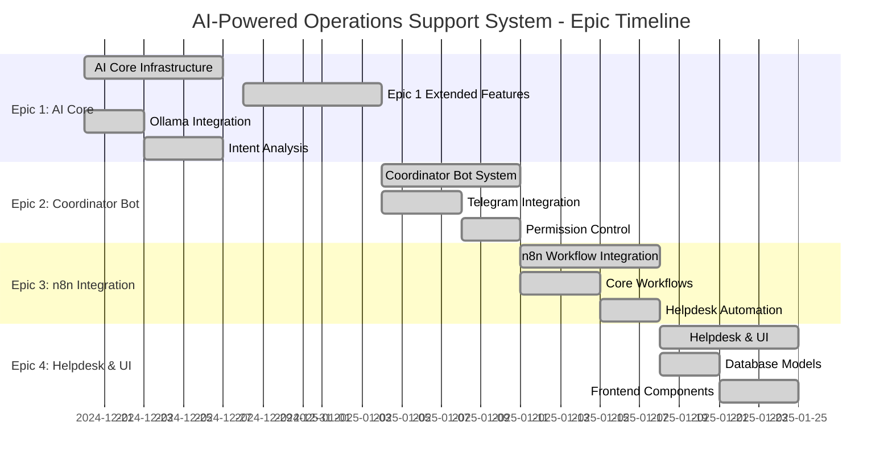

# Epic Overview: AI-Powered Operations Support System

**Project Name:** Hệ thống hỗ trợ vận hành tập trung cho công ty bán mã thẻ, topup/airtime bán buôn  
**Date:** 2024-12-19  
**Version:** 1.0  
**Status:** Draft

---

## Executive Summary

This document provides a comprehensive overview of the Epic structure for the AI-Powered Operations Support System MVP. The system is organized into 4 main Epics that build upon each other to deliver a complete AI-powered operations support solution.

**Key Principles:**
- **Incremental Delivery:** Each Epic builds upon the previous one
- **Risk Mitigation:** Start with foundation (AI Core) before complex features
- **MVP Focus:** Deliver core value in first 2 Epics
- **Technical Simplicity:** Monolithic extension approach, no microservices

**Current Status:**
- **MVP COMPLETED:** All 4 Epics have been successfully implemented ✅
- **System Status:** ⚠️ **CRITICAL SECURITY ISSUES** - Multi-system architecture problems identified
- **Epic 4 Status:** ✅ **DOCUMENTATION UPDATED** - Status corrected from "Planning" to "Completed"
- **Critical Gap:** ✅ **RESOLVED** - `check_logs` workflow implemented (needs manual activation)
- **Intent Coverage:** ✅ **COMPLETED** - 5/5 intents implemented (100% complete)
- **Next Phase:** ⚠️ **CRITICAL** - Fix multi-system security issues before production deployment

**Intent Coverage Status:**
| Intent | Status | Workflow | Webhook | Notes |
|--------|--------|----------|---------|-------|
| `create_notification` | ✅ **ACTIVE** | Notification System | `/webhook/notification-system` | Fully functional |
| `check_logs` | ✅ **CREATED** | Check Logs - Epic 1 | `/webhook/check-logs` | **Needs manual activation** |
| `create_ticket` | ✅ **ACTIVE** | Helpdesk Ticket Management | `/webhook-test/helpdesk-ticket` | Fully functional |
| `check_trans` | ✅ **ACTIVE** | Transaction Status API | `/webhook/transaction-status` | Fully functional |
| `health_check` | ✅ **ACTIVE** | Health Monitoring | Cron-based | Fully functional |

**🚨 Critical Multi-System Issues:**
| Issue | Severity | Impact | Status |
|-------|----------|--------|--------|
| **Telegram Groups không liên kết System** | 🔴 **CRITICAL** | Security breach risk | ⚠️ **IDENTIFIED** |
| **API thiếu System Context** | 🔴 **CRITICAL** | Data isolation failure | ⚠️ **IDENTIFIED** |
| **Permission System không System-Aware** | 🟡 **HIGH** | Over-privileged access | ⚠️ **IDENTIFIED** |

**📋 Required Actions:**
1. **IMMEDIATE**: Stop production deployment
2. **WEEK 1**: Fix database schema (add `systemId` fields)
3. **WEEK 2**: Update all API endpoints and workflows
4. **WEEK 3**: Test multi-system isolation thoroughly

---

## Epic Structure Overview

### Epic Dependencies & Timeline

### Epic Dependencies Matrix

| Epic | Dependencies | Duration | Team Size | Risk Level | Status |
|------|--------------|----------|-----------|------------|---------|
| **Epic 1: AI Core** | None | 7 days | 1-2 devs | LOW | ✅ **COMPLETED** |
| **Epic 2: Coordinator Bot** | Epic 1 | 7 days | 1-2 devs | MEDIUM | ✅ **COMPLETED** |
| **Epic 3: n8n Integration** | Epic 1 + 2 | 7 days | 1-2 devs | MEDIUM | ✅ **COMPLETED** |
| **Epic 4: Helpdesk & UI** | Epic 1 + 2 | 7 days | 1-2 devs | LOW | ✅ **COMPLETED** |

**Total MVP Timeline:** 28 days (4 weeks) - **COMPLETED** ✅
**Critical Path:** Epic 1 → Epic 2 → Epic 3 → Epic 4 - **ALL COMPLETED** ✅

---

## Epic 1: AI Core Infrastructure

### Epic Overview
**Purpose:** Establish the foundational AI capabilities using Ollama for intent analysis and response generation.

**Business Value:** Enables the system to understand natural language requests and provide intelligent responses.

**Success Criteria:**
- ✅ Ollama service running and accessible
- ✅ Intent analysis API working with >80% accuracy
- ✅ Fallback mechanisms operational
- ✅ Error handling and monitoring in place
- 🆕 Message filtering prevents spam and unnecessary processing
- 🆕 Role-based access control ensures system security
- 🆕 Transaction status checking works reliably
- 🆕 Supplier responses are properly managed and tracked

### Epic Scope

#### **In Scope:**
- Ollama container setup and configuration
- AI Service module with intent analysis
- Confidence scoring and threshold management
- Fallback to rule-based analysis
- Error handling and service resilience
- Basic monitoring and logging
- Message filtering and tag processing (@bot, /command)
- Role-based access control (Admin/User/Supplier)
- Transaction status API integration
- Supplier response management and admin notification

#### **Out of Scope:**
- Advanced AI model training
- Vector database integration
- Multi-language support beyond Vietnamese
- Complex entity extraction

### Epic Stories (High-Level)

1. **Story 1.1:** Setup Ollama service and basic AI integration ✅
2. **Story 1.2:** Implement intent analysis with confidence scoring ✅
3. **Story 1.3:** Create fallback mechanisms and error handling ✅
4. **Story 1.4:** Add monitoring and health checks ✅
5. **Story 1.5:** Message filtering and tag processing 🆕
6. **Story 1.6:** Role-based access control 🆕
7. **Story 1.7:** Transaction status API integration 🆕
8. **Story 1.8:** Supplier response management 🆕

### Technical Requirements

#### **Backend Components:**
- AI Service Module (`src/services/ai.service.js`)
- Ollama Client (`src/utils/ollama-client.js`)
- Intent Analysis Controller (`src/controllers/ai.controller.js`)
- AI Intent Models (`prisma/schema.prisma`)

#### **Configuration:**
- Ollama Docker container
- AI service environment variables
- Confidence thresholds configuration
- Fallback rule patterns

#### **API Endpoints:**
- `POST /api/ai/intent` - Intent analysis
- `POST /api/ai/response` - Response generation
- `GET /api/ai/health` - Service health check

---

## Epic 2: Coordinator Bot System

### Epic Overview
**Purpose:** Implement the core Coordinator Bot logic that routes messages, manages conversations, and triggers appropriate workflows.

**Business Value:** Provides intelligent message routing and conversation management for all user interactions.

**Success Criteria:**
- ✅ Coordinator Bot can route 80% of messages correctly
- ✅ Message processing pipeline operational
- ✅ Basic conversation management working
- ✅ Workflow triggering mechanism in place

### Epic Scope

#### **In Scope:**
- Coordinator Bot core logic
- Message routing and intent-based decisions
- Conversation state management
- Basic workflow triggering
- Telegram Bot API integration
- Message persistence and history

#### **Out of Scope:**
- Advanced conversation analytics
- Multi-bot coordination
- Complex workflow orchestration
- Advanced user management

### Epic Stories (High-Level)

1. **Story 2.1:** Implement Coordinator Bot core logic
2. **Story 2.2:** Create message routing and conversation management
3. **Story 2.3:** Integrate with Telegram Bot API
4. **Story 2.4:** Add workflow triggering capabilities

### Technical Requirements

#### **Backend Components:**
- Coordinator Service (`src/services/coordinator.service.js`)
- Telegram Bot Service (`src/services/telegram.service.js`)
- Conversation Controller (`src/controllers/conversation.controller.js`)
- Message Models (`prisma/schema.prisma`)

#### **Configuration:**
- Telegram Bot tokens and webhooks
- Coordinator routing rules
- Conversation timeout settings
- Workflow trigger mappings

#### **API Endpoints:**
- `POST /api/coordinator/process` - Process incoming message
- `GET /api/conversations/:id` - Get conversation history
- `POST /api/coordinator/route` - Manual message routing

---

## Epic 3: n8n Workflow Integration

### Epic Overview
**Purpose:** Integrate n8n workflow engine to automate business processes and handle complex operations triggered by the Coordinator Bot.

**Business Value:** Enables automation of repetitive tasks and complex business processes.

**Success Criteria:**
- ✅ n8n service running and accessible
- ✅ Basic workflows created and functional
- ✅ Workflow execution monitoring working
- ✅ Error handling and retry mechanisms in place

### Epic Scope

#### **In Scope:**
- n8n container setup and configuration
- Basic workflow templates (notifications, support tickets)
- Workflow execution API integration
- Execution monitoring and status tracking
- Basic error handling and retry logic

#### **Out of Scope:**
- Complex workflow orchestration
- Advanced workflow analytics
- Custom workflow builder UI
- Workflow versioning and rollback

### Epic Stories (High-Level)

1. **Story 3.1:** Setup n8n service and basic configuration
2. **Story 3.2:** Create basic workflow templates
3. **Story 3.3:** Implement workflow execution API
4. **Story 3.4:** Add execution monitoring and error handling

### Technical Requirements

#### **Backend Components:**
- Workflow Service (`src/services/workflow.service.js`)
- n8n Client (`src/utils/n8n-client.js`)
- Workflow Controller (`src/controllers/workflow.controller.js`)
- Workflow Execution Models (`prisma/schema.prisma`)

#### **Configuration:**
- n8n Docker container
- API key authentication
- Workflow templates (JSON files)
- Execution timeout settings

#### **API Endpoints:**
- `POST /api/workflows/trigger` - Trigger workflow execution
- `GET /api/workflows/executions/:id` - Get execution status
- `GET /api/workflows/status` - Get all workflow statuses

---

## Epic 4: Helpdesk & UI

### Epic Overview
**Purpose:** Implement the helpdesk system and user interface components to provide a complete user experience for admins and support agents.

**Business Value:** Provides user-friendly interface for managing support requests and monitoring system performance.

**Success Criteria:**
- ✅ Helpdesk database models implemented
- ✅ Basic UI components working
- ✅ Ticket management functional
- ✅ AI performance dashboard operational

### Epic Scope

#### **In Scope:**
- Helpdesk database schema
- Basic UI components (atoms, molecules, organisms)
- Ticket creation and management
- AI performance monitoring dashboard
- Basic user authentication and authorization

#### **Out of Scope:**
- Advanced reporting and analytics
- Mobile app development
- Advanced user management features
- Custom theming and branding

### Epic Stories (High-Level)

1. **Story 4.1:** Implement helpdesk database models and API
2. **Story 4.2:** Create basic UI component library
3. **Story 4.3:** Build ticket management interface
4. **Story 4.4:** Implement AI performance dashboard

### Technical Requirements

#### **Backend Components:**
- Helpdesk Controller (`src/controllers/helpdesk.controller.js`)
- Ticket Service (`src/services/helpdesk.service.js`)
- Helpdesk Models (`prisma/schema.prisma`)

#### **Frontend Components:**
- Component Library (`src/components/`)
- Helpdesk Views (`src/views/`)
- State Management (`src/stores/`)
- API Integration (`src/composables/`)

#### **API Endpoints:**
- `POST /api/helpdesk/tickets` - Create ticket
- `GET /api/helpdesk/tickets` - List tickets
- `PUT /api/helpdesk/tickets/:id` - Update ticket
- `GET /api/helpdesk/analytics` - Get helpdesk analytics

---

## Implementation Strategy

### Phase 1: Foundation (Epic 1 + 2)
**Duration:** 2 weeks
**Focus:** Core AI capabilities and bot logic
**Deliverable:** Working AI-powered bot system

**Key Milestones:**
- Week 1: AI Core Infrastructure complete
- Week 2: Coordinator Bot System operational

**Success Metrics:**
- Ollama service running
- Intent analysis working with >80% accuracy
- Basic message routing functional

### Phase 2: Automation (Epic 3)
**Duration:** 1 week
**Focus:** Workflow automation and execution
**Deliverable:** Automated business processes

**Key Milestones:**
- Week 3: n8n integration complete
- Basic workflows operational

**Success Metrics:**
- n8n service running
- Basic workflows executing successfully
- Execution monitoring working

### Phase 3: User Experience (Epic 4)
**Duration:** 1 week
**Focus:** User interface and helpdesk system
**Deliverable:** Complete user experience

**Key Milestones:**
- Week 4: Helpdesk system complete
- UI components operational

**Success Metrics:**
- Helpdesk system functional
- UI components working
- AI performance dashboard operational

---

## Risk Assessment & Mitigation

### Epic 1: AI Core Infrastructure
**Risks:**
- Ollama model performance issues
- Intent analysis accuracy below 80%

**Mitigation:**
- Start with proven models (llama2:7b)
- Implement comprehensive fallback mechanisms
- Continuous monitoring and feedback loop

### Epic 2: Coordinator Bot System
**Risks:**
- Complex routing logic
- Telegram API rate limits

**Mitigation:**
- Start with simple routing rules
- Implement rate limiting and retry logic
- Comprehensive error handling

### Epic 3: n8n Integration
**Risks:**
- Workflow complexity
- Execution failures

**Mitigation:**
- Start with simple workflow templates
- Implement comprehensive error handling
- Execution monitoring and alerting

### Epic 4: Helpdesk & UI
**Risks:**
- UI component complexity
- Performance issues

**Mitigation:**
- Use proven design patterns
- Implement lazy loading and optimization
- Comprehensive testing

---

## Success Metrics & KPIs

### Technical Metrics
- **System Uptime:** >99.5%
- **API Response Time:** <2 seconds
- **Intent Recognition Accuracy:** >80%
- **Workflow Success Rate:** >95%

### Business Metrics
- **Request Processing Time:** <5 minutes
- **Notification Creation Time:** <10 minutes
- **User Satisfaction:** >4.5/5.0
- **System Capacity:** 100 requests/day

### Development Metrics
- **Code Coverage:** >80%
- **Bug Rate:** <5 bugs per epic
- **Documentation Coverage:** 100%
- **Test Automation:** >90%

---

## Next Steps

### Immediate Actions
1. **Create Detailed Stories** for Epic 1 (AI Core Infrastructure)
2. **Setup Development Environment** with Docker Compose
3. **Begin Epic 1 Implementation** with Story 1.1

### Story Creation Priority
1. **Epic 1 Stories** (Foundation)
2. **Epic 2 Stories** (Core Logic)
3. **Epic 3 Stories** (Automation)
4. **Epic 4 Stories** (User Experience)

### Development Handoff
**Epic Overview này cung cấp roadmap tổng thể cho MVP development.**

**Next Step:** Tạo detailed user stories cho Epic 1 để bắt đầu implementation.

---

## Conclusion

This Epic Overview provides a clear roadmap for implementing the AI-Powered Operations Support System MVP. The incremental approach ensures that each Epic builds upon the previous one, delivering value at each stage while maintaining technical simplicity.

**Key Benefits:**
- ✅ **Clear Roadmap:** 4 Epics with clear dependencies and timeline
- ✅ **Risk Mitigation:** Start with foundation, build complexity gradually
- ✅ **MVP Focus:** Core value delivered in first 2 Epics
- ✅ **Technical Simplicity:** Monolithic extension, no microservices complexity

**Ready for Story Creation:** Epic structure is clear, ready to create detailed user stories for Epic 1.

---

*Epic Overview created using BMAD-METHOD™ framework*
