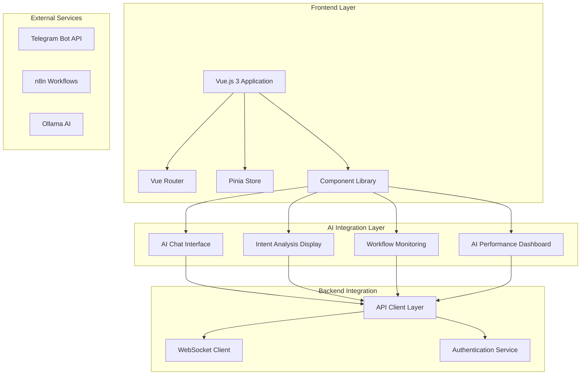
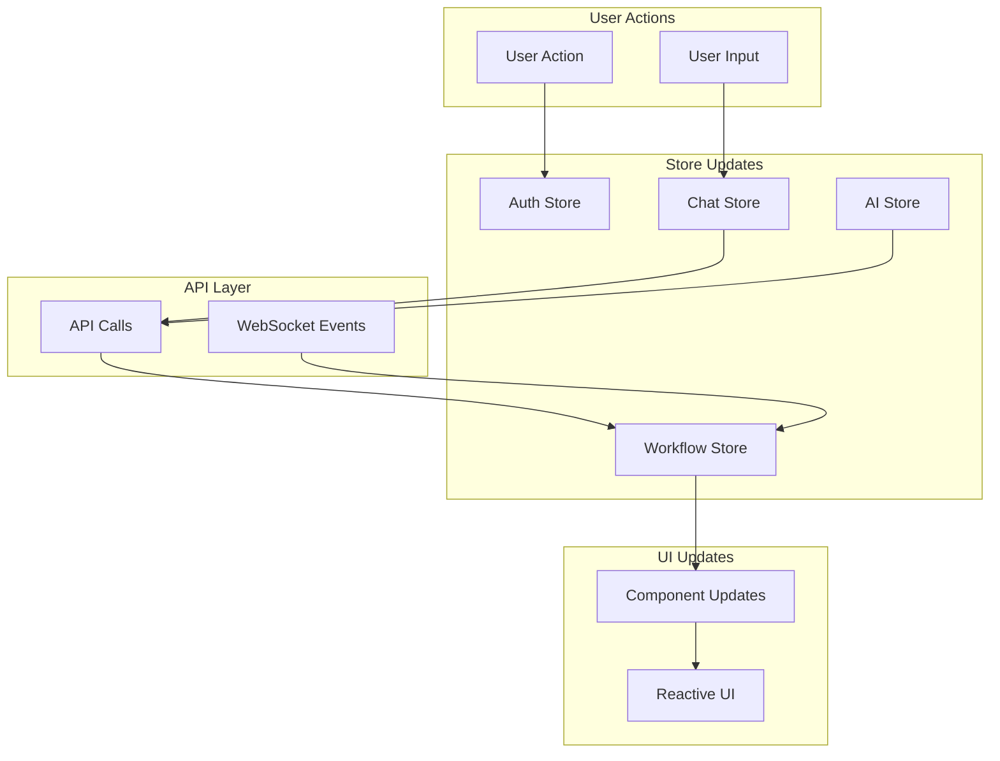

# Frontend Architecture: Hệ thống hỗ trợ vận hành tập trung với AI

**Project Name:** Hệ thống hỗ trợ vận hành tập trung cho công ty bán mã thẻ, topup/airtime bán buôn  
**Date:** 2024-12-19  
**Version:** 1.0  
**Status:** Draft

---

## Executive Summary

This document defines the comprehensive Frontend Architecture for the AI-powered Operations Support System, extending the existing Unified Inbox frontend with new AI capabilities, workflow monitoring, and enhanced user experience.

**Key Principles:**
- **Extend Existing:** Build upon existing Vue.js + Tailwind CSS foundation
- **AI-First Design:** Prioritize AI integration and natural language interaction
- **Responsive & Accessible:** Mobile-first design with WCAG 2.1 AA compliance
- **Performance Optimized:** Lazy loading, code splitting, and efficient state management

---

## High Level Architecture

### Frontend Architecture Overview



### Technology Stack

| Category | Technology | Version | Purpose |
|----------|------------|---------|---------|
| **Framework** | Vue.js | 3.4+ | Progressive JavaScript framework |
| **Build Tool** | Vite | 5.0+ | Fast build tool and dev server |
| **Styling** | Tailwind CSS | 3.4+ | Utility-first CSS framework |
| **State Management** | Pinia | 2.1+ | Vue 3 state management |
| **Routing** | Vue Router | 4.2+ | Client-side routing |
| **HTTP Client** | Axios | 1.6+ | HTTP client for API calls |
| **Real-time** | Socket.io-client | 4.8+ | WebSocket communication |
| **Testing** | Vitest | 1.0+ | Unit testing framework |
| **Component Library** | Custom | - | Atomic design system |

---

## Component Architecture

### 1. Atomic Design Implementation

#### Atoms (Basic Building Blocks)
- **Button:** Primary, secondary, outline, ghost, danger variants
- **Input:** Text, number, email, password with validation
- **Icon:** SVG icon system with consistent sizing
- **Avatar:** User profile images with fallbacks
- **Badge:** Status indicators and notifications
- **Typography:** Heading, paragraph, and text components

#### Molecules (Simple Combinations)
- **SearchBar:** Input with search icon and filters
- **FormField:** Input with label, validation, and error display
- **Alert:** Success, warning, error, and info notifications
- **LoadingSpinner:** Loading indicators with size variants
- **DataCard:** Information display with actions
- **NavigationItem:** Menu items with icons and labels

#### Organisms (Complex Components)
- **ChatWindow:** Real-time chat interface with AI integration
- **DataTable:** Sortable, filterable data display
- **Sidebar:** Navigation and context-sensitive actions
- **Header:** Main navigation and user controls
- **WorkflowMonitor:** n8n workflow status and control
- **AIDashboard:** AI performance metrics and controls

#### Templates (Page Layouts)
- **DashboardLayout:** Admin dashboard with sidebar and main content
- **SupportLayout:** Support interface with chat and ticket management
- **AuthLayout:** Authentication pages with consistent styling

### 2. Component Organization

```
src/
├── components/
│   ├── atoms/                    # Basic building blocks
│   │   ├── Button/
│   │   ├── Input/
│   │   ├── Icon/
│   │   ├── Avatar/
│   │   └── Badge/
│   ├── molecules/                # Simple combinations
│   │   ├── SearchBar/
│   │   ├── Alert/
│   │   ├── FormField/
│   │   └── LoadingSpinner/
│   ├── organisms/                # Complex components
│   │   ├── ChatWindow/
│   │   ├── DataTable/
│   │   ├── Sidebar/
│   │   └── Header/
│   └── templates/                # Page layouts
│       ├── DashboardLayout/
│       ├── SupportLayout/
│       └── AuthLayout/
├── composables/                   # Reusable logic
│   ├── useApi.js
│   ├── useAuth.js
│   ├── useChat.js
│   ├── useAI.js
│   └── useNotifications.js
├── views/                         # Page components
│   ├── AdminDashboard/
│   ├── SupportInterface/
│   ├── Settings/
│   └── Login/
└── stores/                        # Pinia stores
    ├── auth.js
    ├── chat.js
    ├── ai.js
    └── workflow.js
```

---

## Page Architecture

### 1. Admin Dashboard

**Purpose:** Central control center for operations team

**Key Components:**
- **AI Performance Monitor:** Intent recognition accuracy, fallback rates
- **Workflow Status:** n8n workflow execution status and control
- **System Health:** Service status, error rates, performance metrics
- **Quick Actions:** Common operations with AI assistance
- **Recent Activity:** Latest system events and user interactions

**Layout Structure:**
```
┌─────────────────────────────────────────────────────────┐
│ Header (Navigation, User Menu, Notifications)          │
├─────────────────────────────────────────────────────────┤
│ Sidebar (Navigation, Quick Actions) │ Main Content     │
│                                      │                 │
│ • Dashboard                          │ • AI Dashboard  │
│ • AI Management                      │ • Workflow      │
│ • Workflows                          │   Monitor       │
│ • Helpdesk                           │ • System        │
│ • Settings                           │   Health        │
│                                      │ • Quick         │
│                                      │   Actions       │
└─────────────────────────────────────────────────────────┘
```

### 2. Support Interface

**Purpose:** Customer support with AI assistance

**Key Components:**
- **Chat Interface:** Real-time chat with AI coordinator
- **Ticket Management:** Helpdesk ticket creation and tracking
- **Knowledge Base:** AI-powered search and suggestions
- **User Context:** Customer information and history
- **AI Insights:** Intent analysis and suggested responses

**Layout Structure:**
```
┌─────────────────────────────────────────────────────────┐
│ Header (User Info, Support Status, Quick Actions)      │
├─────────────────────────────────────────────────────────┤
│ Chat Panel │ Context Panel                             │
│            │                                            │
│ • AI Chat  │ • User Info                               │
│ • History  │ • Ticket Status                           │
│ • Quick    │ • Knowledge Base                          │
│   Actions  │ • AI Insights                             │
└─────────────────────────────────────────────────────────┘
```

### 3. AI Management Interface

**Purpose:** Monitor and control AI system performance

**Key Components:**
- **Intent Analysis Monitor:** Real-time intent recognition metrics
- **Fallback Statistics:** Rule-based fallback usage and performance
- **Training Data Management:** User feedback and correction handling
- **Model Performance:** Ollama model accuracy and response times
- **System Configuration:** AI service settings and thresholds

---

## State Management Architecture

### 1. Pinia Store Structure

#### Auth Store
```javascript
// stores/auth.js
export const useAuthStore = defineStore('auth', {
  state: () => ({
    user: null,
    token: null,
    isAuthenticated: false,
    permissions: []
  }),
  
  getters: {
    hasPermission: (state) => (permission) => {
      return state.permissions.includes(permission)
    }
  },
  
  actions: {
    async login(credentials) {
      // Login logic
    },
    async logout() {
      // Logout logic
    }
  }
})
```

#### AI Store
```javascript
// stores/ai.js
export const useAIStore = defineStore('ai', {
  state: () => ({
    intentAnalysis: {
      accuracy: 0,
      fallbackRate: 0,
      responseTime: 0
    },
    recentIntents: [],
    trainingData: [],
    modelStatus: 'ready'
  }),
  
  actions: {
    async analyzeIntent(message) {
      // AI intent analysis
    },
    async updateTrainingData(correction) {
      // Update training data
    }
  }
})
```

#### Chat Store
```javascript
// stores/chat.js
export const useChatStore = defineStore('chat', {
  state: () => ({
    conversations: [],
    activeConversation: null,
    messages: [],
    aiAssistance: true
  }),
  
  actions: {
    async sendMessage(message) {
      // Send message logic
    },
    async getAIResponse(message) {
      // Get AI response
    }
  }
})
```

### 2. State Flow Architecture



---

## API Integration Architecture

### 1. API Client Layer

```javascript
// composables/useApi.js
export function useApi() {
  const apiClient = axios.create({
    baseURL: import.meta.env.VITE_API_BASE_URL,
    timeout: 30000
  })
  
  // Request interceptor
  apiClient.interceptors.request.use(
    (config) => {
      const token = useAuthStore().token
      if (token) {
        config.headers.Authorization = `Bearer ${token}`
      }
      return config
    },
    (error) => Promise.reject(error)
  )
  
  // Response interceptor
  apiClient.interceptors.response.use(
    (response) => response,
    (error) => {
      if (error.response?.status === 401) {
        useAuthStore().logout()
      }
      return Promise.reject(error)
    }
  )
  
  return {
    get: (url, config) => apiClient.get(url, config),
    post: (url, data, config) => apiClient.post(url, data, config),
    put: (url, data, config) => apiClient.put(url, data, config),
    delete: (url, config) => apiClient.delete(url, config)
  }
}
```

### 2. AI Service Integration

```javascript
// composables/useAI.js
export function useAI() {
  const { post } = useApi()
  const aiStore = useAIStore()
  
  const analyzeIntent = async (message, context = {}) => {
    try {
      const response = await post('/api/ai/intent', {
        message,
        context
      })
      
      // Update store with results
      aiStore.updateIntentAnalysis(response.data)
      
      return response.data
    } catch (error) {
      console.error('AI intent analysis failed:', error)
      throw error
    }
  }
  
  const getAIResponse = async (intent, context = {}) => {
    try {
      const response = await post('/api/ai/response', {
        intent,
        context
      })
      
      return response.data
    } catch (error) {
      console.error('AI response generation failed:', error)
      throw error
    }
  }
  
  return {
    analyzeIntent,
    getAIResponse
  }
}
```

### 3. WebSocket Integration

```javascript
// composables/useWebSocket.js
export function useWebSocket() {
  const socket = ref(null)
  const isConnected = ref(false)
  const chatStore = useChatStore()
  const workflowStore = useWorkflowStore()
  
  const connect = () => {
    socket.value = io(import.meta.env.VITE_WS_URL, {
      auth: {
        token: useAuthStore().token
      }
    })
    
    socket.value.on('connect', () => {
      isConnected.value = true
    })
    
    socket.value.on('disconnect', () => {
      isConnected.value = false
    })
    
    // Chat events
    socket.value.on('message', (message) => {
      chatStore.addMessage(message)
    })
    
    // Workflow events
    socket.value.on('workflow_update', (update) => {
      workflowStore.updateWorkflow(update)
    })
  }
  
  const disconnect = () => {
    if (socket.value) {
      socket.value.disconnect()
    }
  }
  
  return {
    connect,
    disconnect,
    isConnected
  }
}
```

---

## Routing Architecture

### 1. Route Configuration

```javascript
// router/index.js
import { createRouter, createWebHistory } from 'vue-router'
import { useAuthStore } from '@/stores/auth'

const routes = [
  {
    path: '/',
    redirect: '/dashboard'
  },
  {
    path: '/login',
    name: 'Login',
    component: () => import('@/views/Login.vue'),
    meta: { requiresAuth: false }
  },
  {
    path: '/dashboard',
    name: 'Dashboard',
    component: () => import('@/views/AdminDashboard.vue'),
    meta: { requiresAuth: true, requiresRole: 'admin' }
  },
  {
    path: '/support',
    name: 'Support',
    component: () => import('@/views/SupportInterface.vue'),
    meta: { requiresAuth: true }
  },
  {
    path: '/ai-management',
    name: 'AIManagement',
    component: () => import('@/views/AIManagement.vue'),
    meta: { requiresAuth: true, requiresRole: 'admin' }
  },
  {
    path: '/settings',
    name: 'Settings',
    component: () => import('@/views/Settings.vue'),
    meta: { requiresAuth: true }
  }
]

const router = createRouter({
  history: createWebHistory(),
  routes
})

// Navigation guards
router.beforeEach((to, from, next) => {
  const authStore = useAuthStore()
  
  if (to.meta.requiresAuth && !authStore.isAuthenticated) {
    next('/login')
  } else if (to.meta.requiresRole && !authStore.hasPermission(to.meta.requiresRole)) {
    next('/dashboard')
  } else {
    next()
  }
})

export default router
```

### 2. Route Structure

```
/                           → Redirect to Dashboard
/login                      → Authentication
/dashboard                  → Admin Dashboard
/support                    → Support Interface
/ai-management             → AI System Management
/settings                   → User Settings
```

---

## Styling Architecture

### 1. Tailwind CSS Configuration

```javascript
// tailwind.config.js
module.exports = {
  content: [
    "./index.html",
    "./src/**/*.{vue,js,ts,jsx,tsx}"
  ],
  theme: {
    extend: {
      colors: {
        primary: {
          50: '#eff6ff',
          500: '#3b82f6',
          900: '#1e3a8a'
        },
        success: {
          50: '#f0fdf4',
          500: '#22c55e',
          900: '#14532d'
        },
        warning: {
          50: '#fffbeb',
          500: '#f59e0b',
          900: '#78350f'
        },
        error: {
          50: '#fef2f2',
          500: '#ef4444',
          900: '#7f1d1d'
        }
      },
      fontFamily: {
        sans: ['Inter', 'system-ui', 'sans-serif'],
        mono: ['JetBrains Mono', 'monospace']
      },
      spacing: {
        '18': '4.5rem',
        '88': '22rem'
      }
    }
  },
  plugins: [
    require('@tailwindcss/forms'),
    require('@tailwindcss/typography')
  ]
}
```

### 2. Component Styling Strategy

```vue
<!-- Component with Tailwind CSS -->
<template>
  <div class="ai-chat-window bg-white rounded-lg shadow-lg border border-gray-200">
    <div class="ai-chat-window__header p-4 border-b border-gray-200">
      <h3 class="text-lg font-semibold text-gray-900">
        AI Assistant
      </h3>
    </div>
    
    <div class="ai-chat-window__content p-4 space-y-4">
      <slot />
    </div>
  </div>
</template>

<style scoped>
/* Component-specific styles that can't be handled by Tailwind */
.ai-chat-window {
  min-height: 400px;
}

.ai-chat-window__content {
  max-height: 500px;
  overflow-y: auto;
}
</style>
```

---

## Performance Architecture

### 1. Code Splitting Strategy

```javascript
// Lazy loading for routes
const AdminDashboard = () => import('@/views/AdminDashboard.vue')
const SupportInterface = () => import('@/views/SupportInterface.vue')

// Lazy loading for components
const ChatWindow = defineAsyncComponent(() => import('@/components/organisms/ChatWindow.vue'))
const DataTable = defineAsyncComponent(() => import('@/components/organisms/DataTable.vue'))
```

### 2. Bundle Optimization

```javascript
// vite.config.js
export default defineConfig({
  build: {
    rollupOptions: {
      output: {
        manualChunks: {
          vendor: ['vue', 'vue-router', 'pinia'],
          ui: ['@headlessui/vue', '@heroicons/vue'],
          utils: ['axios', 'socket.io-client']
        }
      }
    }
  }
})
```

### 3. Performance Monitoring

```javascript
// composables/usePerformance.js
export function usePerformance() {
  const measurePageLoad = () => {
    const navigation = performance.getEntriesByType('navigation')[0]
    return {
      loadTime: navigation.loadEventEnd - navigation.loadEventStart,
      domContentLoaded: navigation.domContentLoadedEventEnd - navigation.domContentLoadedEventStart
    }
  }
  
  const measureComponentRender = (componentName) => {
    const start = performance.now()
    
    return {
      end: () => {
        const duration = performance.now() - start
        console.log(`${componentName} rendered in ${duration.toFixed(2)}ms`)
      }
    }
  }
  
  return {
    measurePageLoad,
    measureComponentRender
  }
}
```

---

## Testing Architecture

### 1. Testing Strategy

```javascript
// Component testing with Vitest
import { mount } from '@vue/test-utils'
import { describe, it, expect } from 'vitest'
import ChatWindow from '@/components/organisms/ChatWindow.vue'

describe('ChatWindow', () => {
  it('renders correctly', () => {
    const wrapper = mount(ChatWindow, {
      props: {
        title: 'Test Chat'
      }
    })
    
    expect(wrapper.text()).toContain('Test Chat')
  })
  
  it('emits message event', async () => {
    const wrapper = mount(ChatWindow)
    const input = wrapper.find('input')
    
    await input.setValue('Test message')
    await wrapper.find('button').trigger('click')
    
    expect(wrapper.emitted('message')).toBeTruthy()
  })
})
```

### 2. E2E Testing

```javascript
// E2E testing with Playwright
import { test, expect } from '@playwright/test'

test('admin dashboard loads correctly', async ({ page }) => {
  await page.goto('/dashboard')
  await expect(page.locator('h1')).toContainText('Dashboard')
  await expect(page.locator('.ai-metrics')).toBeVisible()
})
```

---

## Accessibility Architecture

### 1. WCAG 2.1 AA Compliance

```vue
<!-- Accessible component example -->
<template>
  <div 
    class="accessible-component"
    role="region"
    :aria-label="ariaLabel"
    :aria-describedby="describedBy"
  >
    <h2 :id="titleId" class="text-xl font-semibold">
      {{ title }}
    </h2>
    
    <div :id="contentId">
      <slot />
    </div>
    
    <div 
      v-if="error" 
      :id="errorId" 
      class="text-red-600" 
      role="alert"
      aria-live="assertive"
    >
      {{ error }}
    </div>
  </div>
</template>
```

### 2. Keyboard Navigation

```javascript
// Keyboard navigation support
const handleKeydown = (event) => {
  switch (event.key) {
    case 'Enter':
    case ' ':
      event.preventDefault()
      handleActivate()
      break
    case 'Escape':
      handleClose()
      break
    case 'Tab':
      handleTabNavigation(event)
      break
  }
}
```

---

## Security Architecture

### 1. Authentication & Authorization

```javascript
// Route-level permission checking
const checkPermission = (permission) => {
  const authStore = useAuthStore()
  return authStore.hasPermission(permission)
}

// Component-level permission checking
const PermissionGuard = {
  props: ['permission'],
  setup(props) {
    const authStore = useAuthStore()
    const hasPermission = computed(() => 
      authStore.hasPermission(props.permission)
    )
    
    return { hasPermission }
  },
  render() {
    return this.hasPermission ? this.$slots.default() : null
  }
}
```

### 2. Input Validation

```javascript
// Client-side validation
const validateInput = (input, rules) => {
  const errors = []
  
  if (rules.required && !input.trim()) {
    errors.push('This field is required')
  }
  
  if (rules.minLength && input.length < rules.minLength) {
    errors.push(`Minimum length is ${rules.minLength} characters`)
  }
  
  return errors
}
```

---

## Deployment Architecture

### 1. Build Configuration

```javascript
// vite.config.js
export default defineConfig({
  base: process.env.NODE_ENV === 'production' ? '/app/' : '/',
  build: {
    outDir: 'dist',
    assetsDir: 'assets',
    sourcemap: process.env.NODE_ENV === 'development',
    minify: 'terser',
    rollupOptions: {
      output: {
        manualChunks: {
          vendor: ['vue', 'vue-router', 'pinia'],
          ui: ['@headlessui/vue']
        }
      }
    }
  }
})
```

### 2. Environment Configuration

```bash
# .env.development
VITE_API_BASE_URL=http://localhost:3000/api
VITE_WS_URL=http://localhost:3000
VITE_APP_TITLE=Operations Support (Dev)

# .env.production
VITE_API_BASE_URL=https://api.operations-support.com/api
VITE_WS_URL=https://api.operations-support.com
VITE_APP_TITLE=Operations Support
```

---

## Conclusion

This Frontend Architecture provides a comprehensive foundation for building the AI-powered Operations Support System frontend. The architecture extends the existing Vue.js foundation while adding new AI capabilities, workflow monitoring, and enhanced user experience.

**Key Benefits:**
- ✅ **Extends Existing:** Builds upon current Vue.js + Tailwind CSS setup
- ✅ **AI-First Design:** Prioritizes AI integration and natural language interaction
- ✅ **Scalable Architecture:** Atomic design methodology for maintainable components
- ✅ **Performance Optimized:** Lazy loading, code splitting, and efficient state management
- ✅ **Accessibility Compliant:** WCAG 2.1 AA compliance built-in
- ✅ **Security Focused:** Authentication, authorization, and input validation

**Next Steps:**
1. Implement core atom components (Button, Input, Icon)
2. Create molecule components (SearchBar, Alert, FormField)
3. Build organism components (ChatWindow, DataTable, Sidebar)
4. Set up routing and state management
5. Implement AI integration layer
6. Add comprehensive testing coverage

---

*Frontend Architecture created using BMAD-METHOD™ framework*
