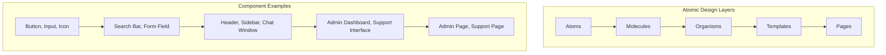

# Frontend Component Design System

**Project:** Hệ thống hỗ trợ vận hành tập trung với AI  
**Date:** 2024-12-19  
**Version:** 1.0  
**Status:** Draft

---

## Executive Summary

This document defines the comprehensive Frontend Component Design System for the AI-powered Operations Support System, including component patterns, design standards, and implementation guidelines to ensure consistency, maintainability, and excellent user experience.

**Key Principles:**
- **Atomic Design:** Build components from atoms to organisms to templates
- **Consistency:** Unified design language across all components
- **Accessibility:** WCAG 2.1 AA compliance built into every component
- **Performance:** Optimized components with lazy loading and code splitting
- **Maintainability:** Clear patterns and reusable components

---

## Design Philosophy & Architecture

### 1. Atomic Design Methodology



### 2. Component Hierarchy

| Layer | Description | Examples | Responsibility |
|-------|-------------|----------|----------------|
| **Atoms** | Basic building blocks | Button, Input, Icon, Typography | Single responsibility, highly reusable |
| **Molecules** | Simple combinations | Search Bar, Form Field, Alert | Simple functionality, limited state |
| **Organisms** | Complex components | Header, Sidebar, Chat Window | Complex functionality, significant state |
| **Templates** | Page layouts | Dashboard Layout, Support Layout | Structure and composition |
| **Pages** | Specific instances | Admin Dashboard, Support Interface | Content and data |

---

## Component Patterns & Standards

### 1. Base Component Template

```vue
<!-- Base Component Template -->
<template>
  <div 
    :class="componentClasses" 
    :data-testid="testId"
    role="region"
    :aria-label="ariaLabel"
  >
    <!-- Component content -->
    <slot />
  </div>
</template>

<script>
export default {
  name: 'BaseComponent',
  props: {
    // Standard props for all components
    testId: {
      type: String,
      default: ''
    },
    ariaLabel: {
      type: String,
      default: ''
    },
    variant: {
      type: String,
      default: 'default',
      validator: value => ['default', 'primary', 'secondary', 'danger'].includes(value)
    },
    size: {
      type: String,
      default: 'medium',
      validator: value => ['small', 'medium', 'large'].includes(value)
    },
    disabled: {
      type: Boolean,
      default: false
    }
  },
  computed: {
    componentClasses() {
      return [
        'base-component',
        `base-component--${this.variant}`,
        `base-component--${this.size}`,
        {
          'base-component--disabled': this.disabled
        }
      ]
    }
  },
  methods: {
    // Standard methods for all components
    handleClick(event) {
      if (this.disabled) return
      this.$emit('click', event)
    }
  }
}
</script>

<style scoped>
/* Base component styles */
.base-component {
  /* Base styles */
}

/* Variant styles */
.base-component--primary { /* ... */ }
.base-component--secondary { /* ... */ }
.base-component--danger { /* ... */ }

/* Size styles */
.base-component--small { /* ... */ }
.base-component--medium { /* ... */ }
.base-component--large { /* ... */ }

/* State styles */
.base-component--disabled { /* ... */ }
</style>
```

### 2. Form Component Pattern

```vue
<!-- Form Component Pattern -->
<template>
  <div class="form-component" :class="formClasses">
    <label 
      v-if="label" 
      :for="inputId" 
      class="form-component__label"
      :class="{ 'form-component__label--required': required }"
    >
      {{ label }}
      <span v-if="required" class="form-component__required" aria-label="required">*</span>
    </label>
    
    <div class="form-component__input-wrapper">
      <input
        :id="inputId"
        :type="type"
        :value="modelValue"
        :placeholder="placeholder"
        :disabled="disabled"
        :required="required"
        :aria-describedby="errorId"
        :aria-invalid="hasError"
        class="form-component__input"
        :class="{ 'form-component__input--error': hasError }"
        @input="handleInput"
        @blur="handleBlur"
        @focus="handleFocus"
      />
      
      <div 
        v-if="hasError" 
        :id="errorId" 
        class="form-component__error" 
        role="alert"
      >
        {{ errorMessage }}
      </div>
    </div>
    
    <div v-if="hint" class="form-component__hint">
      {{ hint }}
    </div>
  </div>
</template>

<script>
export default {
  name: 'FormInput',
  props: {
    modelValue: {
      type: [String, Number],
      default: ''
    },
    label: {
      type: String,
      default: ''
    },
    type: {
      type: String,
      default: 'text'
    },
    placeholder: {
      type: String,
      default: ''
    },
    required: {
      type: Boolean,
      default: false
    },
    disabled: {
      type: Boolean,
      default: false
    },
    error: {
      type: String,
      default: ''
    },
    hint: {
      type: String,
      default: ''
    }
  },
  computed: {
    inputId() {
      return `input-${this._uid}`
    },
    errorId() {
      return `error-${this._uid}`
    },
    hasError() {
      return !!this.error
    },
    formClasses() {
      return {
        'form-component--error': this.hasError,
        'form-component--disabled': this.disabled
      }
    }
  },
  methods: {
    handleInput(event) {
      this.$emit('update:modelValue', event.target.value)
      this.$emit('input', event.target.value)
    },
    handleBlur(event) {
      this.$emit('blur', event)
    },
    handleFocus(event) {
      this.$emit('focus', event)
    }
  }
}
</script>
```

### 3. Data Display Component Pattern

```vue
<!-- Data Display Component Pattern -->
<template>
  <div class="data-display" :class="displayClasses">
    <div class="data-display__header" v-if="title || $slots.header">
      <h3 v-if="title" class="data-display__title">{{ title }}</h3>
      <slot name="header" />
    </div>
    
    <div class="data-display__content">
      <div v-if="loading" class="data-display__loading">
        <LoadingSpinner :size="loadingSize" />
      </div>
      
      <div v-else-if="error" class="data-display__error">
        <Alert 
          type="error" 
          :message="error" 
          @retry="$emit('retry')"
        />
      </div>
      
      <div v-else-if="isEmpty" class="data-display__empty">
        <slot name="empty">
          <EmptyState :message="emptyMessage" />
        </slot>
      </div>
      
      <div v-else class="data-display__data">
        <slot />
      </div>
    </div>
    
    <div class="data-display__footer" v-if="$slots.footer">
      <slot name="footer" />
    </div>
  </div>
</template>

<script>
export default {
  name: 'DataDisplay',
  props: {
    title: {
      type: String,
      default: ''
    },
    loading: {
      type: Boolean,
      default: false
    },
    error: {
      type: String,
      default: ''
    },
    isEmpty: {
      type: Boolean,
      default: false
    },
    emptyMessage: {
      type: String,
      default: 'No data available'
    },
    loadingSize: {
      type: String,
      default: 'medium'
    }
  },
  computed: {
    displayClasses() {
      return {
        'data-display--loading': this.loading,
        'data-display--error': this.error,
        'data-display--empty': this.isEmpty
      }
    }
  }
}
</script>
```

---

## Core Component Library

### 1. Atom Components

#### Button Component
```vue
<!-- Button Atom -->
<template>
  <button
    :type="buttonType"
    :disabled="disabled"
    :class="buttonClasses"
    :aria-label="ariaLabel"
    :data-testid="testId"
    @click="handleClick"
  >
    <Icon 
      v-if="icon" 
      :name="icon" 
      :size="iconSize" 
      class="button__icon"
    />
    <span v-if="$slots.default" class="button__text">
      <slot />
    </span>
    <Icon 
      v-if="iconRight" 
      :name="iconRight" 
      :size="iconSize" 
      class="button__icon-right"
    />
  </button>
</template>

<script>
export default {
  name: 'Button',
  props: {
    variant: {
      type: String,
      default: 'primary',
      validator: value => ['primary', 'secondary', 'outline', 'ghost', 'danger'].includes(value)
    },
    size: {
      type: String,
      default: 'medium',
      validator: value => ['small', 'medium', 'large'].includes(value)
    },
    buttonType: {
      type: String,
      default: 'button'
    },
    icon: {
      type: String,
      default: ''
    },
    iconRight: {
      type: String,
      default: ''
    },
    disabled: {
      type: Boolean,
      default: false
    },
    loading: {
      type: Boolean,
      default: false
    }
  },
  computed: {
    buttonClasses() {
      return [
        'button',
        `button--${this.variant}`,
        `button--${this.size}`,
        {
          'button--disabled': this.disabled,
          'button--loading': this.loading
        }
      ]
    },
    iconSize() {
      const sizeMap = {
        small: '16',
        medium: '20',
        large: '24'
      }
      return sizeMap[this.size]
    }
  },
  methods: {
    handleClick(event) {
      if (this.disabled || this.loading) return
      this.$emit('click', event)
    }
  }
}
</script>
```

#### Input Component
```vue
<!-- Input Atom -->
<template>
  <div class="input-wrapper" :class="wrapperClasses">
    <label 
      v-if="label" 
      :for="inputId" 
      class="input__label"
      :class="{ 'input__label--required': required }"
    >
      {{ label }}
    </label>
    
    <div class="input__container">
      <Icon 
        v-if="icon" 
        :name="icon" 
        class="input__icon" 
        :class="{ 'input__icon--left': icon, 'input__icon--right': iconRight }"
      />
      
      <input
        :id="inputId"
        :type="inputType"
        :value="modelValue"
        :placeholder="placeholder"
        :disabled="disabled"
        :readonly="readonly"
        :required="required"
        :maxlength="maxlength"
        :minlength="minlength"
        :pattern="pattern"
        :aria-describedby="describedBy"
        :aria-invalid="hasError"
        class="input__field"
        :class="inputClasses"
        @input="handleInput"
        @change="handleChange"
        @focus="handleFocus"
        @blur="handleBlur"
      />
      
      <Icon 
        v-if="iconRight" 
        :name="iconRight" 
        class="input__icon input__icon--right"
      />
      
      <button
        v-if="clearable && modelValue"
        type="button"
        class="input__clear"
        @click="handleClear"
        aria-label="Clear input"
      >
        <Icon name="close" size="16" />
      </button>
    </div>
    
    <div 
      v-if="error" 
      :id="errorId" 
      class="input__error" 
      role="alert"
    >
      {{ error }}
    </div>
    
    <div v-if="hint" class="input__hint">
      {{ hint }}
    </div>
  </div>
</template>

<script>
export default {
  name: 'Input',
  props: {
    modelValue: {
      type: [String, Number],
      default: ''
    },
    type: {
      type: String,
      default: 'text'
    },
    label: {
      type: String,
      default: ''
    },
    placeholder: {
      type: String,
      default: ''
    },
    icon: {
      type: String,
      default: ''
    },
    iconRight: {
      type: String,
      default: ''
    },
    clearable: {
      type: Boolean,
      default: false
    },
    required: {
      type: Boolean,
      default: false
    },
    disabled: {
      type: Boolean,
      default: false
    },
    readonly: {
      type: Boolean,
      default: false
    },
    error: {
      type: String,
      default: ''
    },
    hint: {
      type: String,
      default: ''
    },
    maxlength: {
      type: Number,
      default: undefined
    },
    minlength: {
      type: Number,
      default: undefined
    },
    pattern: {
      type: String,
      default: ''
    }
  },
  computed: {
    inputId() {
      return `input-${this._uid}`
    },
    errorId() {
      return `error-${this._uid}`
    },
    hasError() {
      return !!this.error
    },
    describedBy() {
      const ids = []
      if (this.error) ids.push(this.errorId)
      if (this.hint) ids.push(`hint-${this._uid}`)
      return ids.length ? ids.join(' ') : undefined
    },
    wrapperClasses() {
      return {
        'input-wrapper--error': this.hasError,
        'input-wrapper--disabled': this.disabled
      }
    },
    inputClasses() {
      return {
        'input__field--error': this.hasError,
        'input__field--with-icon': this.icon,
        'input__field--with-icon-right': this.iconRight
      }
    }
  },
  methods: {
    handleInput(event) {
      this.$emit('update:modelValue', event.target.value)
      this.$emit('input', event.target.value)
    },
    handleChange(event) {
      this.$emit('change', event.target.value)
    },
    handleFocus(event) {
      this.$emit('focus', event)
    },
    handleBlur(event) {
      this.$emit('blur', event)
    },
    handleClear() {
      this.$emit('update:modelValue', '')
      this.$emit('clear')
    }
  }
}
</script>
```

### 2. Molecule Components

#### Search Bar Component
```vue
<!-- Search Bar Molecule -->
<template>
  <div class="search-bar" :class="searchBarClasses">
    <div class="search-bar__input-container">
      <Input
        v-model="searchQuery"
        :placeholder="placeholder"
        :disabled="disabled"
        icon="search"
        clearable
        @input="handleSearch"
        @clear="handleClear"
        @focus="handleFocus"
        @blur="handleBlur"
      />
    </div>
    
    <div v-if="showFilters" class="search-bar__filters">
      <slot name="filters" />
    </div>
    
    <div v-if="showResults" class="search-bar__results">
      <slot name="results" :query="searchQuery" />
    </div>
  </div>
</template>

<script>
export default {
  name: 'SearchBar',
  props: {
    placeholder: {
      type: String,
      default: 'Search...'
    },
    disabled: {
      type: Boolean,
      default: false
    },
    showFilters: {
      type: Boolean,
      default: false
    },
    showResults: {
      type: Boolean,
      default: false
    },
    debounceMs: {
      type: Number,
      default: 300
    }
  },
  data() {
    return {
      searchQuery: '',
      debounceTimer: null
    }
  },
  computed: {
    searchBarClasses() {
      return {
        'search-bar--with-filters': this.showFilters,
        'search-bar--with-results': this.showResults
      }
    }
  },
  methods: {
    handleSearch(query) {
      // Debounce search to avoid excessive API calls
      if (this.debounceTimer) {
        clearTimeout(this.debounceTimer)
      }
      
      this.debounceTimer = setTimeout(() => {
        this.$emit('search', query)
      }, this.debounceMs)
    },
    handleClear() {
      this.searchQuery = ''
      this.$emit('clear')
    },
    handleFocus(event) {
      this.$emit('focus', event)
    },
    handleBlur(event) {
      this.$emit('blur', event)
    }
  }
}
</script>
```

#### Alert Component
```vue
<!-- Alert Molecule -->
<template>
  <div 
    :class="alertClasses" 
    :role="alertRole"
    :aria-live="ariaLive"
    :data-testid="testId"
  >
    <Icon 
      :name="iconName" 
      :size="iconSize" 
      class="alert__icon"
    />
    
    <div class="alert__content">
      <div v-if="title" class="alert__title">
        {{ title }}
      </div>
      
      <div class="alert__message">
        <slot>{{ message }}</slot>
      </div>
    </div>
    
    <button
      v-if="dismissible"
      type="button"
      class="alert__close"
      @click="handleDismiss"
      aria-label="Close alert"
    >
      <Icon name="close" size="16" />
    </button>
  </div>
</template>

<script>
export default {
  name: 'Alert',
  props: {
    type: {
      type: String,
      default: 'info',
      validator: value => ['info', 'success', 'warning', 'error'].includes(value)
    },
    title: {
      type: String,
      default: ''
    },
    message: {
      type: String,
      default: ''
    },
    dismissible: {
      type: Boolean,
      default: false
    },
    autoDismiss: {
      type: [Boolean, Number],
      default: false
    }
  },
  computed: {
    alertClasses() {
      return [
        'alert',
        `alert--${this.type}`,
        {
          'alert--dismissible': this.dismissible
        }
      ]
    },
    iconName() {
      const iconMap = {
        info: 'info',
        success: 'check-circle',
        warning: 'alert-triangle',
        error: 'x-circle'
      }
      return iconMap[this.type]
    },
    iconSize() {
      return '20'
    },
    alertRole() {
      return this.type === 'error' ? 'alert' : 'status'
    },
    ariaLive() {
      return this.type === 'error' ? 'assertive' : 'polite'
    }
  },
  mounted() {
    if (this.autoDismiss && typeof this.autoDismiss === 'number') {
      setTimeout(() => {
        this.handleDismiss()
      }, this.autoDismiss)
    }
  },
  methods: {
    handleDismiss() {
      this.$emit('dismiss')
    }
  }
}
</script>
```

### 3. Organism Components

#### Chat Window Component
```vue
<!-- Chat Window Organism -->
<template>
  <div class="chat-window" :class="chatWindowClasses">
    <div class="chat-window__header">
      <div class="chat-window__title">
        <Icon :name="icon" size="20" />
        <span>{{ title }}</span>
        <Badge v-if="unreadCount" :value="unreadCount" variant="primary" />
      </div>
      
      <div class="chat-window__actions">
        <slot name="actions" />
        <Button
          v-if="minimizable"
          variant="ghost"
          size="small"
          @click="toggleMinimized"
        >
          <Icon :name="minimized ? 'maximize' : 'minimize'" size="16" />
        </Button>
      </div>
    </div>
    
    <div v-if="!minimized" class="chat-window__content">
      <div 
        ref="messagesContainer"
        class="chat-window__messages"
        @scroll="handleScroll"
      >
        <div 
          v-for="message in messages"
          :key="message.id"
          class="chat-message"
          :class="messageClasses(message)"
        >
          <div class="chat-message__avatar">
            <Avatar 
              :src="message.avatar" 
              :alt="message.sender"
              :size="32"
            />
          </div>
          
          <div class="chat-message__content">
            <div class="chat-message__header">
              <span class="chat-message__sender">{{ message.sender }}</span>
              <span class="chat-message__time">{{ formatTime(message.timestamp) }}</span>
            </div>
            
            <div class="chat-message__text">
              {{ message.text }}
            </div>
            
            <div v-if="message.attachments" class="chat-message__attachments">
              <slot name="attachments" :attachments="message.attachments" />
            </div>
          </div>
        </div>
        
        <div v-if="loading" class="chat-window__loading">
          <LoadingSpinner size="small" />
        </div>
      </div>
      
      <div class="chat-window__input">
        <div class="chat-window__input-container">
          <Input
            v-model="newMessage"
            :placeholder="inputPlaceholder"
            :disabled="disabled"
            @keydown.enter="handleSend"
          />
          
          <Button
            :disabled="!newMessage.trim() || disabled"
            @click="handleSend"
          >
            <Icon name="send" size="16" />
          </Button>
        </div>
        
        <div class="chat-window__input-actions">
          <slot name="input-actions" />
        </div>
      </div>
    </div>
  </div>
</template>

<script>
export default {
  name: 'ChatWindow',
  props: {
    title: {
      type: String,
      required: true
    },
    icon: {
      type: String,
      default: 'message-circle'
    },
    messages: {
      type: Array,
      default: () => []
    },
    loading: {
      type: Boolean,
      default: false
    },
    disabled: {
      type: Boolean,
      default: false
    },
    minimizable: {
      type: Boolean,
      default: true
    },
    unreadCount: {
      type: Number,
      default: 0
    },
    inputPlaceholder: {
      type: String,
      default: 'Type a message...'
    }
  },
  data() {
    return {
      newMessage: '',
      minimized: false,
      isScrolledToBottom: true
    }
  },
  computed: {
    chatWindowClasses() {
      return {
        'chat-window--minimized': this.minimized,
        'chat-window--loading': this.loading
      }
    }
  },
  watch: {
    messages: {
      handler() {
        this.$nextTick(() => {
          this.scrollToBottom()
        })
      },
      deep: true
    }
  },
  methods: {
    messageClasses(message) {
      return {
        'chat-message--own': message.isOwn,
        'chat-message--system': message.type === 'system'
      }
    },
    formatTime(timestamp) {
      return new Date(timestamp).toLocaleTimeString()
    },
    handleSend() {
      if (!this.newMessage.trim() || this.disabled) return
      
      this.$emit('send', this.newMessage.trim())
      this.newMessage = ''
    },
    handleScroll(event) {
      const { scrollTop, scrollHeight, clientHeight } = event.target
      this.isScrolledToBottom = scrollTop + clientHeight >= scrollHeight - 10
    },
    scrollToBottom() {
      if (this.isScrolledToBottom) {
        this.$refs.messagesContainer.scrollTop = this.$refs.messagesContainer.scrollHeight
      }
    },
    toggleMinimized() {
      this.minimized = !this.minimized
      this.$emit('minimize', this.minimized)
    }
  }
}
</script>
```

---

## Component Organization & File Structure

### 1. Directory Structure

```
src/
├── components/
│   ├── atoms/                    # Basic building blocks
│   │   ├── Button/
│   │   │   ├── Button.vue
│   │   │   ├── Button.stories.js
│   │   │   ├── Button.test.js
│   │   │   └── index.js
│   │   ├── Input/
│   │   ├── Icon/
│   │   ├── Avatar/
│   │   └── Badge/
│   ├── molecules/                # Simple combinations
│   │   ├── SearchBar/
│   │   ├── Alert/
│   │   ├── FormField/
│   │   └── LoadingSpinner/
│   ├── organisms/                # Complex components
│   │   ├── ChatWindow/
│   │   ├── DataTable/
│   │   ├── Sidebar/
│   │   └── Header/
│   ├── templates/                # Page layouts
│   │   ├── DashboardLayout/
│   │   ├── SupportLayout/
│   │   └── AuthLayout/
│   └── pages/                    # Specific pages
│       ├── AdminDashboard/
│       ├── SupportInterface/
│       └── Settings/
├── composables/                   # Reusable logic
│   ├── useApi.js
│   ├── useAuth.js
│   ├── useChat.js
│   └── useNotifications.js
├── utils/                         # Utility functions
│   ├── validation.js
│   ├── formatting.js
│   └── constants.js
└── styles/                        # Global styles
    ├── variables.css
    ├── components.css
    └── utilities.css
```

### 2. Component File Template

```javascript
// Component index.js
export { default as Button } from './Button.vue'
export { default as ButtonStories } from './Button.stories.js'
export { default as ButtonTest } from './Button.test.js'

// Component stories.js (Storybook)
import Button from './Button.vue'

export default {
  title: 'Atoms/Button',
  component: Button,
  argTypes: {
    variant: {
      control: { type: 'select' },
      options: ['primary', 'secondary', 'outline', 'ghost', 'danger']
    },
    size: {
      control: { type: 'select' },
      options: ['small', 'medium', 'large']
    }
  }
}

export const Primary = {
  args: {
    variant: 'primary',
    children: 'Primary Button'
  }
}

export const Secondary = {
  args: {
    variant: 'secondary',
    children: 'Secondary Button'
  }
}
```

---

## Design Tokens & Variables

### 1. CSS Custom Properties

```css
/* styles/variables.css */
:root {
  /* Colors */
  --color-primary-50: #eff6ff;
  --color-primary-500: #3b82f6;
  --color-primary-900: #1e3a8a;
  
  --color-success-50: #f0fdf4;
  --color-success-500: #22c55e;
  --color-success-900: #14532d;
  
  --color-warning-50: #fffbeb;
  --color-warning-500: #f59e0b;
  --color-warning-900: #78350f;
  
  --color-error-50: #fef2f2;
  --color-error-500: #ef4444;
  --color-error-900: #7f1d1d;
  
  /* Typography */
  --font-family-sans: 'Inter', -apple-system, BlinkMacSystemFont, sans-serif;
  --font-family-mono: 'JetBrains Mono', 'Fira Code', monospace;
  
  --font-size-xs: 0.75rem;
  --font-size-sm: 0.875rem;
  --font-size-base: 1rem;
  --font-size-lg: 1.125rem;
  --font-size-xl: 1.25rem;
  --font-size-2xl: 1.5rem;
  
  --font-weight-normal: 400;
  --font-weight-medium: 500;
  --font-weight-semibold: 600;
  --font-weight-bold: 700;
  
  /* Spacing */
  --spacing-1: 0.25rem;
  --spacing-2: 0.5rem;
  --spacing-3: 0.75rem;
  --spacing-4: 1rem;
  --spacing-5: 1.25rem;
  --spacing-6: 1.5rem;
  --spacing-8: 2rem;
  --spacing-10: 2.5rem;
  --spacing-12: 3rem;
  
  /* Border Radius */
  --radius-sm: 0.125rem;
  --radius-md: 0.375rem;
  --radius-lg: 0.5rem;
  --radius-xl: 0.75rem;
  --radius-2xl: 1rem;
  
  /* Shadows */
  --shadow-sm: 0 1px 2px 0 rgb(0 0 0 / 0.05);
  --shadow-md: 0 4px 6px -1px rgb(0 0 0 / 0.1);
  --shadow-lg: 0 10px 15px -3px rgb(0 0 0 / 0.1);
  --shadow-xl: 0 20px 25px -5px rgb(0 0 0 / 0.1);
  
  /* Transitions */
  --transition-fast: 150ms ease-in-out;
  --transition-normal: 250ms ease-in-out;
  --transition-slow: 350ms ease-in-out;
  
  /* Z-Index */
  --z-dropdown: 1000;
  --z-sticky: 1020;
  --z-fixed: 1030;
  --z-modal-backdrop: 1040;
  --z-modal: 1050;
  --z-popover: 1060;
  --z-tooltip: 1070;
}
```

### 2. Component-Specific Variables

```css
/* Button component styles */
.button {
  display: inline-flex;
  align-items: center;
  justify-content: center;
  gap: var(--spacing-2);
  padding: var(--spacing-2) var(--spacing-4);
  border: 1px solid transparent;
  border-radius: var(--radius-md);
  font-family: var(--font-family-sans);
  font-size: var(--font-size-sm);
  font-weight: var(--font-weight-medium);
  line-height: 1.5;
  text-decoration: none;
  cursor: pointer;
  transition: all var(--transition-fast);
  user-select: none;
}

.button--primary {
  background-color: var(--color-primary-500);
  border-color: var(--color-primary-500);
  color: white;
}

.button--primary:hover:not(:disabled) {
  background-color: var(--color-primary-600);
  border-color: var(--color-primary-600);
}

.button--primary:active:not(:disabled) {
  background-color: var(--color-primary-700);
  border-color: var(--color-primary-700);
}
```

---

## Accessibility Standards

### 1. WCAG 2.1 AA Compliance

```vue
<!-- Accessible Component Example -->
<template>
  <div 
    class="accessible-component"
    role="region"
    :aria-label="ariaLabel"
    :aria-describedby="describedBy"
  >
    <h2 :id="titleId" class="accessible-component__title">
      {{ title }}
    </h2>
    
    <div :id="contentId" class="accessible-component__content">
      <slot />
    </div>
    
    <div 
      v-if="error" 
      :id="errorId" 
      class="accessible-component__error" 
      role="alert"
      aria-live="assertive"
    >
      {{ error }}
    </div>
  </div>
</template>

<script>
export default {
  name: 'AccessibleComponent',
  props: {
    title: {
      type: String,
      required: true
    },
    ariaLabel: {
      type: String,
      default: ''
    },
    error: {
      type: String,
      default: ''
    }
  },
  computed: {
    titleId() {
      return `title-${this._uid}`
    },
    contentId() {
      return `content-${this._uid}`
    },
    errorId() {
      return `error-${this._uid}`
    },
    describedBy() {
      const ids = []
      if (this.error) ids.push(this.errorId)
      return ids.length ? ids.join(' ') : undefined
    }
  }
}
</script>
```

### 2. Keyboard Navigation

```vue
<!-- Keyboard Accessible Component -->
<template>
  <div 
    class="keyboard-component"
    tabindex="0"
    @keydown="handleKeydown"
    @focus="handleFocus"
    @blur="handleBlur"
  >
    <slot />
  </div>
</template>

<script>
export default {
  name: 'KeyboardComponent',
  methods: {
    handleKeydown(event) {
      switch (event.key) {
        case 'Enter':
        case ' ':
          event.preventDefault()
          this.$emit('activate')
          break
        case 'ArrowUp':
          event.preventDefault()
          this.$emit('navigate', 'up')
          break
        case 'ArrowDown':
          event.preventDefault()
          this.$emit('navigate', 'down')
          break
        case 'Escape':
          event.preventDefault()
          this.$emit('close')
          break
      }
    },
    handleFocus() {
      this.$emit('focus')
    },
    handleBlur() {
      this.$emit('blur')
    }
  }
}
</script>
```

---

## Performance Optimization

### 1. Lazy Loading

```vue
<!-- Lazy Loaded Component -->
<template>
  <div class="lazy-component">
    <div v-if="loading" class="lazy-component__loading">
      <LoadingSpinner />
    </div>
    <div v-else-if="error" class="lazy-component__error">
      <Alert type="error" :message="error" @retry="loadComponent" />
    </div>
    <component v-else :is="loadedComponent" v-bind="$attrs" />
  </div>
</template>

<script>
export default {
  name: 'LazyComponent',
  props: {
    componentPath: {
      type: String,
      required: true
    }
  },
  data() {
    return {
      loadedComponent: null,
      loading: true,
      error: null
    }
  },
  async mounted() {
    await this.loadComponent()
  },
  methods: {
    async loadComponent() {
      try {
        this.loading = true
        this.error = null
        
        const module = await import(/* webpackChunkName: "lazy" */ this.componentPath)
        this.loadedComponent = module.default
      } catch (err) {
        this.error = 'Failed to load component'
        console.error('Component loading failed:', err)
      } finally {
        this.loading = false
      }
    }
  }
}
</script>
```

### 2. Virtual Scrolling

```vue
<!-- Virtual Scrolling for Large Lists -->
<template>
  <div 
    ref="container"
    class="virtual-list"
    @scroll="handleScroll"
  >
    <div 
      class="virtual-list__spacer"
      :style="{ height: totalHeight + 'px' }"
    />
    
    <div 
      class="virtual-list__content"
      :style="{ transform: `translateY(${offsetY}px)` }"
    >
      <div
        v-for="item in visibleItems"
        :key="item.id"
        class="virtual-list__item"
        :style="{ height: itemHeight + 'px' }"
      >
        <slot name="item" :item="item" />
      </div>
    </div>
  </div>
</template>

<script>
export default {
  name: 'VirtualList',
  props: {
    items: {
      type: Array,
      required: true
    },
    itemHeight: {
      type: Number,
      required: true
    },
    containerHeight: {
      type: Number,
      required: true
    }
  },
  data() {
    return {
      scrollTop: 0
    }
  },
  computed: {
    totalHeight() {
      return this.items.length * this.itemHeight
    },
    visibleCount() {
      return Math.ceil(this.containerHeight / this.itemHeight) + 2
    },
    startIndex() {
      return Math.floor(this.scrollTop / this.itemHeight)
    },
    endIndex() {
      return Math.min(this.startIndex + this.visibleCount, this.items.length)
    },
    visibleItems() {
      return this.items.slice(this.startIndex, this.endIndex)
    },
    offsetY() {
      return this.startIndex * this.itemHeight
    }
  },
  methods: {
    handleScroll(event) {
      this.scrollTop = event.target.scrollTop
    }
  }
}
</script>
```

---

## Testing Strategy

### 1. Component Testing

```javascript
// Button.test.js
import { mount } from '@vue/test-utils'
import Button from './Button.vue'

describe('Button', () => {
  it('renders correctly with default props', () => {
    const wrapper = mount(Button, {
      slots: {
        default: 'Click me'
      }
    })
    
    expect(wrapper.text()).toBe('Click me')
    expect(wrapper.classes()).toContain('button')
    expect(wrapper.classes()).toContain('button--primary')
    expect(wrapper.classes()).toContain('button--medium')
  })
  
  it('emits click event when clicked', async () => {
    const wrapper = mount(Button)
    
    await wrapper.trigger('click')
    
    expect(wrapper.emitted('click')).toBeTruthy()
  })
  
  it('does not emit click when disabled', async () => {
    const wrapper = mount(Button, {
      props: { disabled: true }
    })
    
    await wrapper.trigger('click')
    
    expect(wrapper.emitted('click')).toBeFalsy()
  })
  
  it('applies correct variant classes', () => {
    const wrapper = mount(Button, {
      props: { variant: 'secondary' }
    })
    
    expect(wrapper.classes()).toContain('button--secondary')
  })
})
```

### 2. Integration Testing

```javascript
// ChatWindow.test.js
import { mount } from '@vue/test-utils'
import ChatWindow from './ChatWindow.vue'

describe('ChatWindow', () => {
  const mockMessages = [
    {
      id: 1,
      sender: 'User',
      text: 'Hello',
      timestamp: new Date(),
      isOwn: true
    },
    {
      id: 2,
      sender: 'Bot',
      text: 'Hi there!',
      timestamp: new Date(),
      isOwn: false
    }
  ]
  
  it('renders messages correctly', () => {
    const wrapper = mount(ChatWindow, {
      props: {
        title: 'Test Chat',
        messages: mockMessages
      }
    })
    
    const messageElements = wrapper.findAll('.chat-message')
    expect(messageElements).toHaveLength(2)
  })
  
  it('emits send event when message is sent', async () => {
    const wrapper = mount(ChatWindow, {
      props: {
        title: 'Test Chat',
        messages: []
      }
    })
    
    const input = wrapper.find('input')
    const sendButton = wrapper.find('button')
    
    await input.setValue('Test message')
    await sendButton.trigger('click')
    
    expect(wrapper.emitted('send')).toBeTruthy()
    expect(wrapper.emitted('send')[0]).toEqual(['Test message'])
  })
})
```

---

## Implementation Guidelines

### 1. Component Creation Checklist

- [ ] **Naming Convention:** Use PascalCase for component names
- [ ] **File Structure:** Follow atomic design directory structure
- [ ] **Props Validation:** Define all props with types and validators
- [ ] **Event Handling:** Emit events for all user interactions
- [ ] **Accessibility:** Include ARIA attributes and keyboard navigation
- [ ] **Styling:** Use CSS custom properties and BEM methodology
- [ ] **Testing:** Create unit tests for all component logic
- [ ] **Documentation:** Include Storybook stories and JSDoc comments

### 2. Performance Best Practices

- [ ] **Lazy Loading:** Use dynamic imports for heavy components
- [ ] **Virtual Scrolling:** Implement for large lists
- [ ] **Debouncing:** Add debounce for search and form inputs
- [ ] **Memoization:** Use computed properties and watchers efficiently
- [ ] **Bundle Splitting:** Separate vendor and component chunks

### 3. Accessibility Checklist

- [ ] **Semantic HTML:** Use appropriate HTML elements
- [ ] **ARIA Labels:** Include descriptive ARIA attributes
- [ ] **Keyboard Navigation:** Support Tab, Enter, Space, Arrow keys
- [ ] **Focus Management:** Handle focus states and focus trapping
- [ ] **Screen Reader:** Test with screen reader software
- [ ] **Color Contrast:** Ensure sufficient color contrast ratios

---

## Conclusion

This Frontend Component Design System provides a comprehensive foundation for building consistent, accessible, and performant user interfaces. The atomic design methodology, combined with clear patterns and standards, ensures that components are reusable, maintainable, and provide excellent user experience.

**Key Benefits:**
- ✅ **Consistency:** Unified design language across all components
- ✅ **Maintainability:** Clear patterns and reusable components
- ✅ **Accessibility:** WCAG 2.1 AA compliance built-in
- ✅ **Performance:** Optimized components with best practices
- ✅ **Developer Experience:** Clear guidelines and examples

**Next Steps:**
1. Implement the core atom components (Button, Input, Icon)
2. Create molecule components (SearchBar, Alert, FormField)
3. Build organism components (ChatWindow, DataTable, Sidebar)
4. Set up Storybook for component documentation
5. Implement comprehensive testing coverage

---

*Frontend Component Design System created using BMAD-METHOD™ framework*
